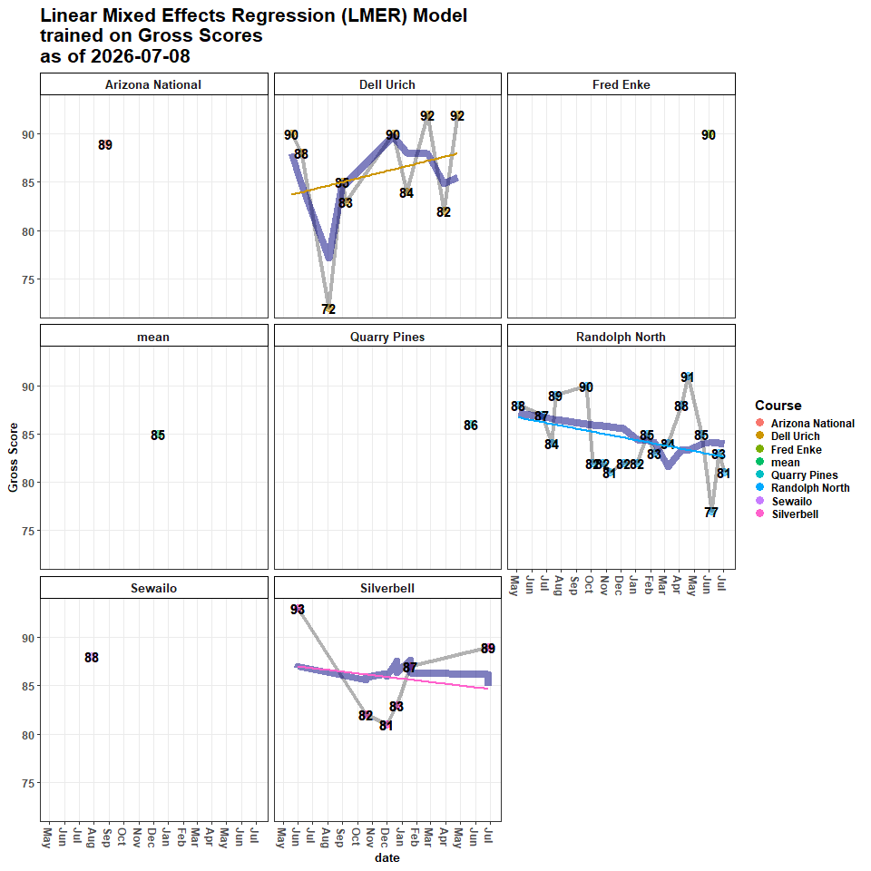
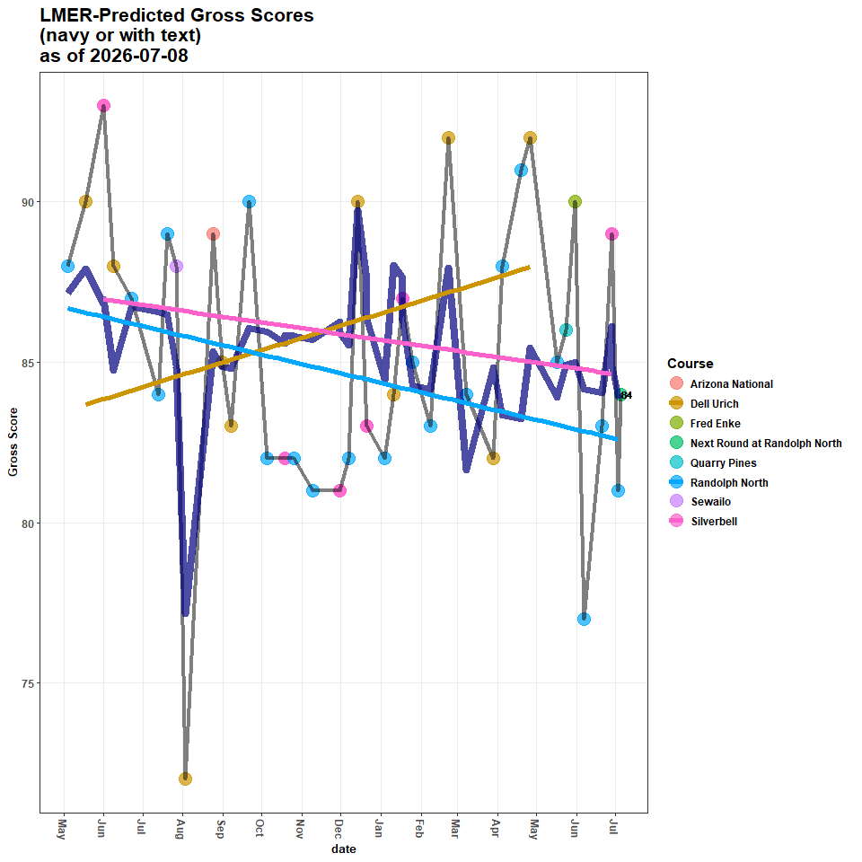
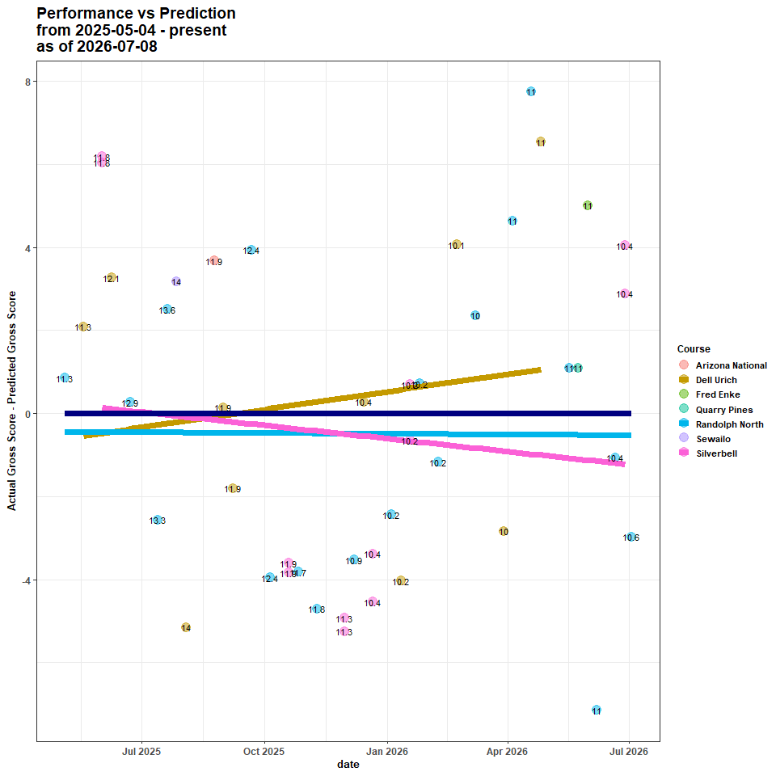
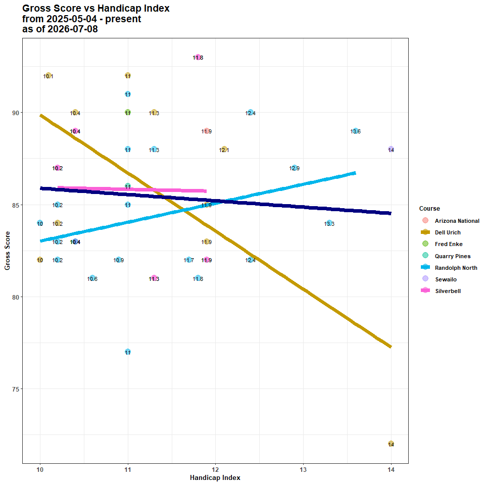

### Overview

This markdown is:

- a rough proxy for a tutorial on interpreting linear mixed model
  outputs

- a light introduction to golf scoring systems

The markdown shows:

- the linear mixed model used to measure my performance for each golf
  round and predict my performance in the next golf round

The model does this by incorporating my skill level and where I’ve
played in the past

### Introduction

Skill level is officially determined by the **USGA** as a
`Handicap Index`: how many strokes, on average, a player takes to
complete a round at a given course with a given difficulty relative to
that course’s average:

- a player with a **10.0** `Handicap Index` is expected, on average, to
  take **82 strokes** to complete a round at a course where the average
  number of strokes has been determined to be **72**

`Gross Score` is a total number of strokes taken by a given player for
any individual hole

- this is extrapolated across each of 18 holes, so while `Gross Score`
  can mean a total of strokes for a hole *or* a total of strokes for a
  round, in this markdown, **it is per round**

- the average `Gross Score` over a player’s best **8 rounds** *from
  their last 20* is used to determine their `Handicap Index`

Thus, this markdown shows the model used to predict the opposite:

- given my `Handicap Index` and `Gross Score`s at previous courses of
  varying difficulty in the past,

  - **what will be my next** `Gross Score`?

Note that I use the terms, `strokes`, and, `shots`, interchangeably,
though putts are not connoted as `shots`

### Gather Data and Format Scores

#### Attach Packages

``` r
library(golf)
library(tidyverse)
library(lme4)
library(DBI)
```

#### Gather Scores

Gather and format from the database

``` r
## connect to the db
con <- golf::get_db_connection()

scores <- DBI::dbGetQuery(conn = con, statement = paste0(
  "SELECT DISTINCT r.*, c.par, c.course_rating, c.slope FROM rounds r
  INNER JOIN courses c
  ON c.tees = r.tees
  AND c.course_name = r.course_name
  AND c.hole = r.hole
  INNER JOIN players p
  ON r.GHIN = p.GHIN
  AND r.handicap_index = p.handicap_index
  AND r.date = p.date;"
)) |> 
  dplyr::mutate(date = lubridate::as_date(date), # convert strings to date's
                hole = gsub(hole, pattern = 'hole_', replacement = '') |> # enforce hole order
                  as.numeric()) |> 
  dplyr::relocate(par, .after = hole) |> 
  dplyr::relocate(course_rating, .after = tees) |>
  dplyr::group_by(date) |> 
  dplyr::arrange(desc(date), hole) |> 
  dplyr::ungroup()
```

#### Compute Metrics

Compute standard metrics

#### Scoring Metrics

Show Per-Round `Gross Score`s, `Net Score`s and `Handicap Index`

``` r
scoring_metrics <- scores_sum |> 
  dplyr::select(`Handicap Index`, `Gross Score`, `Net Score`)
head(scoring_metrics |> 
       dplyr::arrange(desc(date)))
```

    ## # A tibble: 6 × 7
    ## # Groups:   GHIN, date, date_course, course_rating [6]
    ##   GHIN     date       date_course                        course_rating `Handicap Index` `Gross Score` `Net Score`
    ##   <chr>    <date>     <chr>                                      <dbl>            <dbl>         <dbl>       <dbl>
    ## 1 10526424 2026-07-03 "2026-07-03\nRandolph North\n10.6"          69.8             10.6            81          72
    ## 2 10526424 2026-06-28 "2026-06-28\nSilverbell\n10.4"              68               10.4            89          80
    ## 3 10526424 2026-06-28 "2026-06-28\nSilverbell\n10.4"              68.9             10.4            89          80
    ## 4 10526424 2026-06-21 "2026-06-21\nRandolph North\n10.4"          69.8             10.4            83          75
    ## 5 10526424 2026-06-07 "2026-06-07\nRandolph North\n11"            69.8             11              77          68
    ## 6 10526424 2026-05-31 "2026-05-31\nFred Enke\n11"                 68.6             11              90          82

#### Stroke Metrics

In golf, every hole has a `par`– an average number of strokes taken to
get the ball in the hole

There are (almost always), three different `par`s on every course:

- `par 3`s
- `par 4`s
- `par 5`s

A shorthand to determine how a golfer performed across holes is to rate
how many strokes *relative to par* they were (-1, -2, +1, +2, etc)

These numbers are given names:

- `0 = par`
- `-2 = eagle`
- `-1 = birdie`
- `+1 = bogey`
- `+2 = double bogey`

I quantify these below:

``` r
stroke_metrics <- scores_sum |> 
  dplyr::select(`doubles+`, bogies, pars, birdies)
head(stroke_metrics |> 
       dplyr::arrange(desc(date)))
```

    ## # A tibble: 6 × 8
    ## # Groups:   GHIN, date, date_course, course_rating [6]
    ##   GHIN     date       date_course                        course_rating `doubles+` bogies  pars birdies
    ##   <chr>    <date>     <chr>                                      <dbl>      <int>  <int> <int>   <int>
    ## 1 10526424 2026-07-03 "2026-07-03\nRandolph North\n10.6"          69.8          2      6     9       1
    ## 2 10526424 2026-06-28 "2026-06-28\nSilverbell\n10.4"              68            5      7     6       0
    ## 3 10526424 2026-06-28 "2026-06-28\nSilverbell\n10.4"              68.9          5      7     6       0
    ## 4 10526424 2026-06-21 "2026-06-21\nRandolph North\n10.4"          69.8          1      9     8       0
    ## 5 10526424 2026-06-07 "2026-06-07\nRandolph North\n11"            69.8          1      8     5       3
    ## 6 10526424 2026-05-31 "2026-05-31\nFred Enke\n11"                 68.6          5      7     5       1

#### Around-the-Green Metrics

`Chips`: + strokes around the green taken to get onto the green

`Putts`: + strokes taken with the putter on the green

`Avg GIR putts`: + Average \# of putts on holes where the ball was hit
on to the green within 2 strokes of par (green in regulation, `GIR`)

`UpDown%` (aka `Scramble%`): + \# of holes without a `GIR` but par was
made / \# of holes without a `GIR`

``` r
atg_metrics <- scores_sum |> 
  dplyr::select(chips, `chips+putts`, `UpDown%`, putts, `Avg GIR putts`)
head(atg_metrics |> 
       dplyr::arrange(desc(date)))
```

    ## # A tibble: 6 × 9
    ## # Groups:   GHIN, date, date_course, course_rating [6]
    ##   GHIN     date       date_course                        course_rating chips `chips+putts` `UpDown%` putts `Avg GIR putts`
    ##   <chr>    <date>     <chr>                                      <dbl> <dbl>         <dbl>     <dbl> <int>           <dbl>
    ## 1 10526424 2026-07-03 "2026-07-03\nRandolph North\n10.6"          69.8    15            44      41.7    29            1.8 
    ## 2 10526424 2026-06-28 "2026-06-28\nSilverbell\n10.4"              68      16            50      25      34            2.5 
    ## 3 10526424 2026-06-28 "2026-06-28\nSilverbell\n10.4"              68.9    16            50      25      34            2.5 
    ## 4 10526424 2026-06-21 "2026-06-21\nRandolph North\n10.4"          69.8    12            50      25      38            2.44
    ## 5 10526424 2026-06-07 "2026-06-07\nRandolph North\n11"            69.8    15            42      25      27            1.33
    ## 6 10526424 2026-05-31 "2026-05-31\nFred Enke\n11"                 68.6    13            47      20      34            2.2

#### Ball Striking

Approach and tee accuracy

`GIR (green in regulation)`: + hole where the ball was hit on to the
green within 2 strokes of par

`FIR (fairway in regulation)`: + hole where the ball was hit on to the
fairway from the tee box (only on par 4’s and par 5’s)

`Iron FIR`: + hole where an iron was used off the tee for a `FIR`

`Driver FIR`: + hole where driver was used off the tee for a `FIR`

``` r
ball_striking_metrics <- scores_sum |> 
  dplyr::select(GIRs, `GIR%`, `Par 3 GIRs`,
                FIRs, `FIR%`, `Iron FIRs`, `Iron FIR%`,
                `Driver FIRs`, `Driver FIR%`)
head(ball_striking_metrics |> 
       dplyr::arrange(desc(date)))
```

    ## # A tibble: 6 × 13
    ## # Groups:   GHIN, date, date_course, course_rating [6]
    ##   GHIN     date       date_course                        course_rating  GIRs `GIR%` `Par 3 GIRs`  FIRs `FIR%` `Iron FIRs` `Iron FIR%` `Driver FIRs` `Driver FIR%`
    ##   <chr>    <date>     <chr>                                      <dbl> <int>  <dbl>        <dbl> <int>  <dbl>       <dbl>       <dbl>         <dbl>         <dbl>
    ## 1 10526424 2026-07-03 "2026-07-03\nRandolph North\n10.6"          69.8     5   27.8            1     1    7.1           0       NaN               1           7.1
    ## 2 10526424 2026-06-28 "2026-06-28\nSilverbell\n10.4"              68       4   22.2            0     4   30.8           0       NaN               3          25  
    ## 3 10526424 2026-06-28 "2026-06-28\nSilverbell\n10.4"              68.9     4   22.2            0     4   30.8           0       NaN               3          25  
    ## 4 10526424 2026-06-21 "2026-06-21\nRandolph North\n10.4"          69.8     9   50              1     6   42.9           1       100               5          38.5
    ## 5 10526424 2026-06-07 "2026-06-07\nRandolph North\n11"            69.8     6   33.3            1     4   28.6           1       100               3          23.1
    ## 6 10526424 2026-05-31 "2026-05-31\nFred Enke\n11"                 68.6     5   27.8            2     3   21.4           1        12.5             2          33.3

#### Shot Quality

Yardage and accuracy on tracked shots

``` r
## connect to the db
con <- golf::get_db_connection()

stroke_quality <- DBI::dbGetQuery(conn = con,
                                  statement = paste0("SELECT DISTINCT * FROM club_metrics;")) |>
  dplyr::mutate(date = lubridate::as_date(date),
                hole = gsub(hole, pattern = 'hole_', replacement = ''),
                hole = as.integer(hole)) |> 
  dplyr::mutate(dplyr::across(dplyr::contains("yds"), ~as.integer(.x))) |> 
  dplyr::rename(course = course_name) |> 
  dplyr::group_by(date, hole, stroke) |> 
  dplyr::arrange(date, hole, stroke)
head(stroke_quality |> 
       dplyr::arrange(desc(date)))
```

    ## # A tibble: 6 × 14
    ## # Groups:   date, hole, stroke [6]
    ##   course         date       tees   hole   par gross stroke lie     club  yds_to_target yds_traveled on_target miss_direction shot_type
    ##   <chr>          <date>     <chr> <int> <int> <int>  <int> <chr>   <chr>         <int>        <int> <chr>     <chr>          <chr>    
    ## 1 Randolph North 2026-07-03 white     1     4     5      1 tee     D               270          275 no        right          tee      
    ## 2 Randolph North 2026-07-03 white     1     4     5      2 rough   GW               89          110 no        long           choked   
    ## 3 Randolph North 2026-07-03 white     1     4     5      3 rough   GW               21            9 no        short          chip     
    ## 4 Randolph North 2026-07-03 white     1     4     5      4 fairway PW               12           12 yes       on_target      chip     
    ## 5 Randolph North 2026-07-03 white     2     4     6      1 tee     D               270          168 no        left           tee      
    ## 6 Randolph North 2026-07-03 white     2     4     6      2 rough   4               195           64 no        short          punch

### Fit a LMER Model

Fit a lmer model to capture repeated measurements of `Gross Score`
predicted by `Handicap Index`, `course_rating`, and time (`days`).

- Every course has a rating; the `Handicap Index` calculation factors in
  these ratings

- Center the `course_rating` and `Handicap Index` variables at their
  mean to make interpreting intercept and slope estimates more
  meaningful

- Include random intercepts and random slopes of `course` and
  `course_rating`, given a `Handicap Index`

``` r
# Fit a model to the data

gross_lmer <- lme4::lmer(
  
  data = scores_sum |> 
    dplyr::ungroup() |> 
    dplyr::mutate(
      
      course_rating = course_rating - mean(course_rating),
      
      course = gsub(date_course,
                    pattern = '[0-9]|\\-|\\\n|\\.',
                    replacement = ''), # extract the course names
      
      `Handicap Index` = -`Handicap Index` - mean(-`Handicap Index`),
      days = as.numeric(as.Date(date) - min(as.Date(date)) + 1,
                        units = 'days')
      ) |> # create a 'days' metric starting at the first day joining the club 
    
    dplyr::relocate(days, .after = date),
  
  formula = 
    `Gross Score` ~
    `Handicap Index`*course_rating +
    days +
    (1 + `Handicap Index`|course) #+ # random intercepts and random slopes for Gross Score at a given course, given a certain index
    # (1 + `Handicap Index`|course_rating) # random intercepts and random slopes for Gross Score at a given course difficulty, given a certain index
           ) # somewhat redundant
```

#### LMER Model Summary

    ## Linear mixed model fit by REML ['lmerMod']
    ## Formula: `Gross Score` ~ `Handicap Index` * course_rating + days + (1 +      `Handicap Index` | course)
    ##    Data: dplyr::relocate(dplyr::mutate(dplyr::ungroup(scores_sum), course_rating = course_rating -      mean(course_rating), course = gsub(date_course, pattern = "[0-9]|\\-|\\\n|\\.",  
    ##     replacement = ""), `Handicap Index` = -`Handicap Index` -      mean(-`Handicap Index`), days = as.numeric(as.Date(date) -      min(as.Date(date)) + 1, units = "days")), days, .after = date)
    ## 
    ## REML criterion at convergence: 256.5
    ## 
    ## Scaled residuals: 
    ##      Min       1Q   Median       3Q      Max 
    ## -1.75898 -0.86644  0.06728  0.78151  1.90641 
    ## 
    ## Random effects:
    ##  Groups   Name             Variance Std.Dev. Corr  
    ##  course   (Intercept)       0.03658 0.1912         
    ##           `Handicap Index`  1.50799 1.2280   -1.00 
    ##  Residual                  16.52182 4.0647         
    ## Number of obs: 45, groups:  course, 7
    ## 
    ## Fixed effects:
    ##                                 Estimate Std. Error t value
    ## (Intercept)                    87.462971   1.652175  52.938
    ## `Handicap Index`                0.738489   1.038671   0.711
    ## course_rating                  -0.353149   0.485005  -0.728
    ## days                           -0.007523   0.006900  -1.090
    ## `Handicap Index`:course_rating -1.031005   0.602940  -1.710
    ## 
    ## Correlation of Fixed Effects:
    ##             (Intr) `HInd` crs_rt days  
    ## `HndcpIndx`  0.381                     
    ## course_rtng  0.303 -0.020              
    ## days        -0.915 -0.495 -0.316       
    ## `HIndx`:cr_ -0.127  0.230 -0.077 -0.025
    ## optimizer (nloptwrap) convergence code: 0 (OK)
    ## boundary (singular) fit: see help('isSingular')

### Model Interpretations

#### Fixed Effects

##### Gross Score Intercept

The model’s estimated average *first* `Gross Score` (**`(Intercept)`
`Estimate` of `Fixed effects`**) at my average `Handicap Index` and
average `course_rating` at `Arizona National` (default reference course)
is **87.46**.

My average `Gross Score`, however, is **85.44**.

##### Handicap Index

For every additional `Handicap Index` point improvement (lower) than my
average `Handicap Index`, my expected `Gross Score` decreases by
**0.74** strokes.

- This makes sense because `Gross Score` is used to directly determine
  `Handicap Index` and is positively correlated:

  - high `Gross Score` = high `Handicap Index`

  - In other words, a player with better skill will have a lower
    `Handicap Index`

    - An example: a player with a **0** index means they average `par`
      (the course average) for an entire round, across rounds, while a
      worse player (who averages above `par`, the course average) will
      have a higher `Handicap Index`

    - `Handicap Index` corrects for skill-level

  - The effect is not significant (**`t value` = 0.71**; significance :
    abs(**t value**) \> 1)

  - Again, `Handicap Index` is a metric *directly derived from*
    `Gross Score`

    - I’m unsure how many strokes (`Gross Score`) index points *should*
      be worth! **1?** **More?**

    - Does it vary by skill, or is it uniform?

##### Course Rating

For every additional `course_rating` point (aka, a stroke) greater than
the average `course_rating` (~69-70 strokes in this dataset),
`Gross Score` increases by **-0.35** strokes (it decreases).

- This also makes sense: harder courses should yield higher
  `Gross Score`s

##### Time (days)

For every additional `day` in time, my `Gross Score` drops by **-0.01**
strokes

- While this seems tiny, extrapolating days to months or weeks, this
  becomes very evident (**-0.3** strokes per month; **-3.65** strokes
  per year)

- Linear extrapolation in this sense is misleading: there will be a
  limit to lowering `Gross Score` and there will also be variation in
  the process

- But this effect is strongly significant (**t value =** **-1.09**) and
  appears to be the primary driver of the trend

##### Handicap Index\*Course Rating Interaction

As `course_rating` increases by 1 stroke above average, the effect of
`Handicap Index` on my expected `Gross Score` is **1.03** strokes less
than what the two effects would contribute independently.

- In other words: hard courses already impose a big penalty, so the
  *extra* penalty by playing worse than average is smaller
- Related: easier courses impose a larger *extra* penalty by playing
  worse than average
- Related: harder courses add a larger bonus when playing better than
  average
- Related: easier courses add a smaller bonus when playing better than
  average

#### Random Effects

##### Course, Handicap Index, and Time

These `courses` vary in their difficulty, independent of player skill
(`Handicap Index`), by ~ **+/- 0.19** strokes. This value is the
**`Random effects` `Std. Dev.` (`Intercept`) from the model summary**–
the `Std.Dev.` of the course-level random intercepts, representing how
much each course shifts my baseline expected `Gross Score` up or down
relative to the overall average, *even after accounting for
`course_rating`*.

- I play different courses much differently

Interestingly, `courses` also differ slightly in how sensitive they are
to my `Handicap Index`, with a random-slope standard deviation of **+/-
1.23** strokes per index point.

While there is a fair amount of variability in `Gross Score` driven by
the `course`, there is also just a large amount of variability in
`Gross Score`, overall: **4.06**. This is the `Random effects`
`Residual` `Std.Dev.` from the model summary.

### Predict the Next Round

Predict the next round’s `Gross Score` according to the model

##### Show Prediction

``` r
## show the model-predicted gross score for the upcoming round, rounded to the nearest stroke
stats::predict(object = gross_lmer, newdata = new_df, allow.new.levels = T) |>
  as.numeric() %>%
  round(., 0)
```

    ## [1] 84

#### Plot the Model

##### Model by Course

<!-- -->

The model is a random intercept, random slope linear mixed-effects
regression (LMER) model.

In this case, that means `Gross Score` varies for each course at a given
`Handicap Index` in its deviation from the overall mean `Gross Score`
(navy blue line) over time: `Silverbell`, `Randolph North`, and
`Dell Urich` have their own average `Gross Scores` (intercepts) and
slopes (change in `Gross Score` over time)– notice how the line for each
course has a different slope, starting at a different y-intercept

- The `blue` line is the model’s overall fit of the `Gross Score`,
  accounting for `course`, `course_rating`, `Handicap Index`, and `days`
  (time)
- `Silverbell`’s line represents the relationship between `Gross Score`,
  `course_rating`, `Handicap Index`, and `days` (date/time) at
  `Silverbell`
- `Randolph`’s line represents the relationship between `Gross Score`,
  `course_rating`, `Handicap Index`, and `days` (date/time) at
  `Randolph North`
- `Dell Urich`’s line represents the relationship between `Gross Score`,
  `course_rating`, `Handicap Index`, and `days` (date/time) at
  `Dell Urich`

##### Model Predictions

These predictions are **not** historical– they are current:

- i.e. the model did *not* predict anything close to the **72** in
  August 2025

<!-- -->

##### Actual Gross vs Predicted Gross (performance vs prediction)

<!-- -->

This plot of residuals reveals the `Actual Gross Score` relative to the
`Predicted Gross Score` over time, color-coded by `course`, and
annotated by `Handicap Index` at the time of the round.

- the navy blue line represents the dividing line between over/under
  performing where:

  - scores **above** the line = I performed **worse** than the model’s
    prediction
  - scores **below** the line = I performed **better** than the model’s
    prediction

- `Randolph North`, `Silverbell`, and `Dell Urich` each have lines
  representing the trend of actual `Gross Score`s compared to predicted
  `Gross Score`s at each respective course

  - I more often score better/lower at `Randolph North` than the model
    predicts, though, on average, these are closest to the model’s
    predictions

    - This might reveal that these rounds are contributing more weight
      to the model if they are not simply more reflective of the overall
      trend

    - This could also reveal that I score more consistently at this
      course than others

    - This could also mean that, given the downward trend, the course is
      easier than ratings suggest

  - At `Silverbell` and `Randolph North`, I have been outperforming the
    model and scoring better over time

  - The variability at `Dell Urich` is substantial, with one large
    outlier overperformance (~ **-15**), and one moderate outlier
    underperformance (~ **+6**) re-shaping the slope in the opposite
    direction: I have been getting worse at `Dell Urich` over time

    - Even with more subsequent sample, this could reveal that I
      struggle to shoot low `Gross Score`s at `Dell Urich`, despite its
      easier course rating, and any effect of time

    - Other latent variables may contribute to this variability, such as
      course/weather/event conditions

<!-- -->
