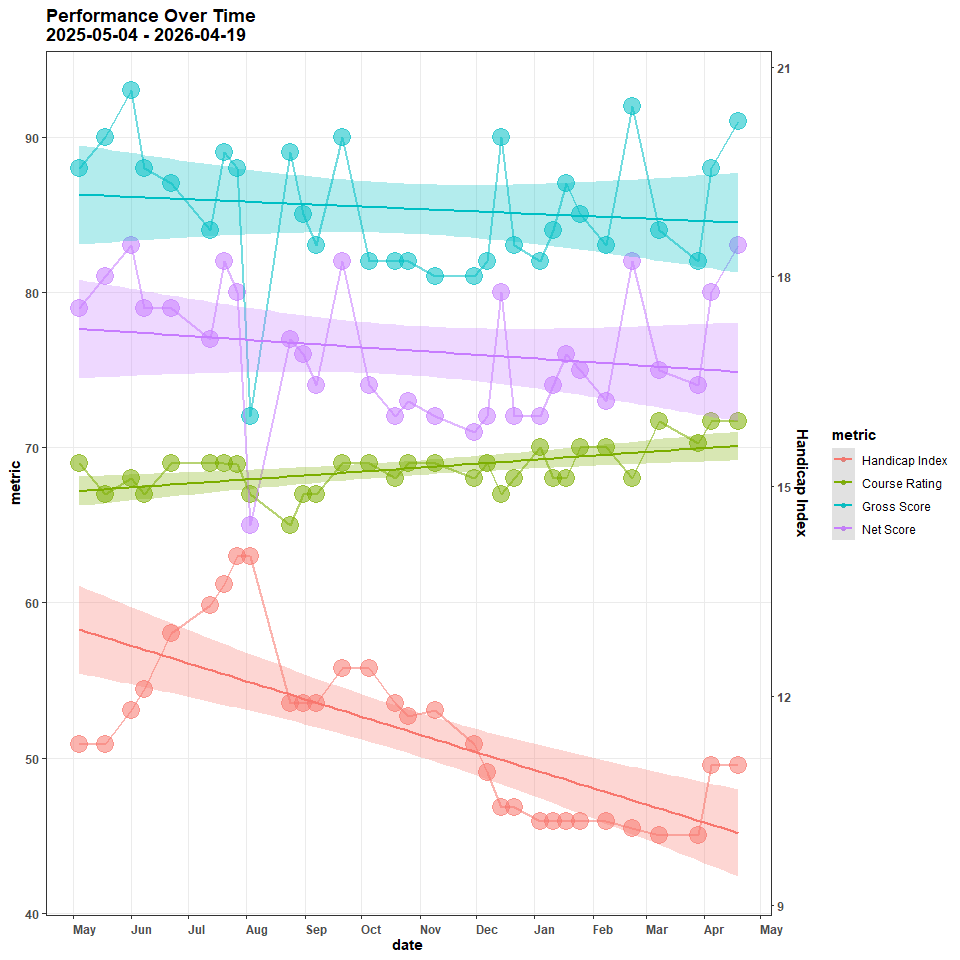
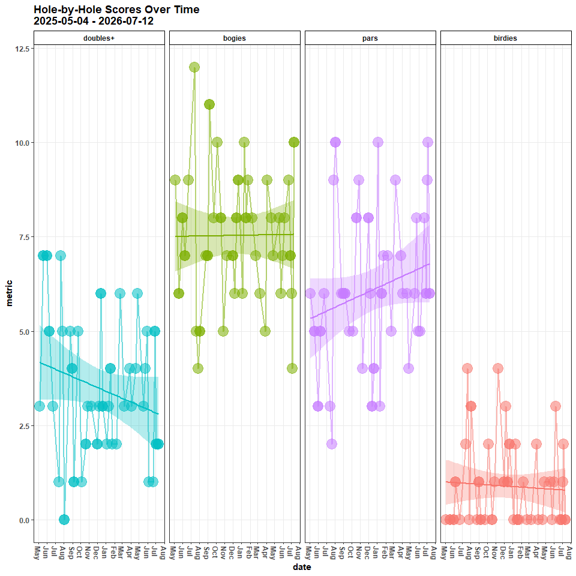
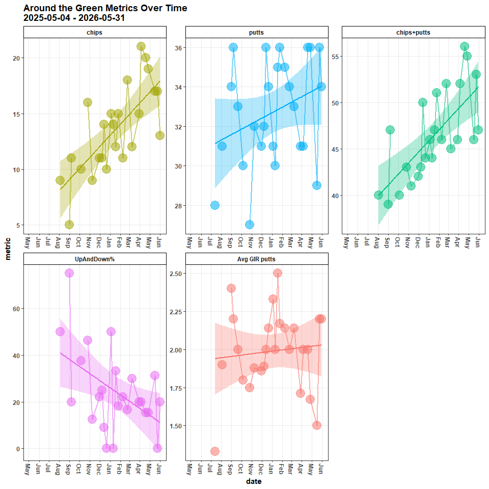
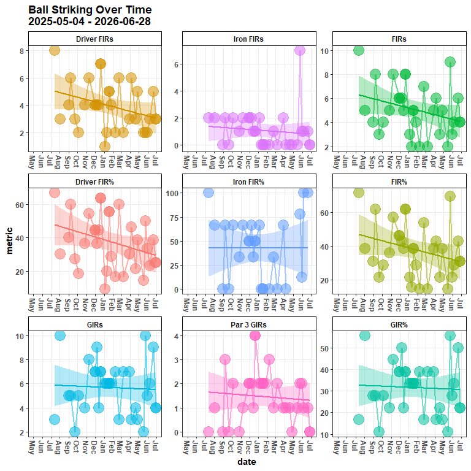
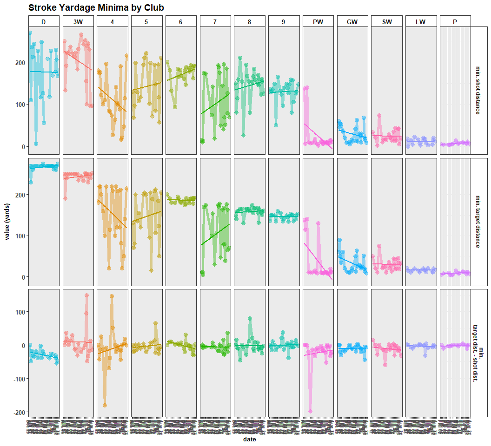
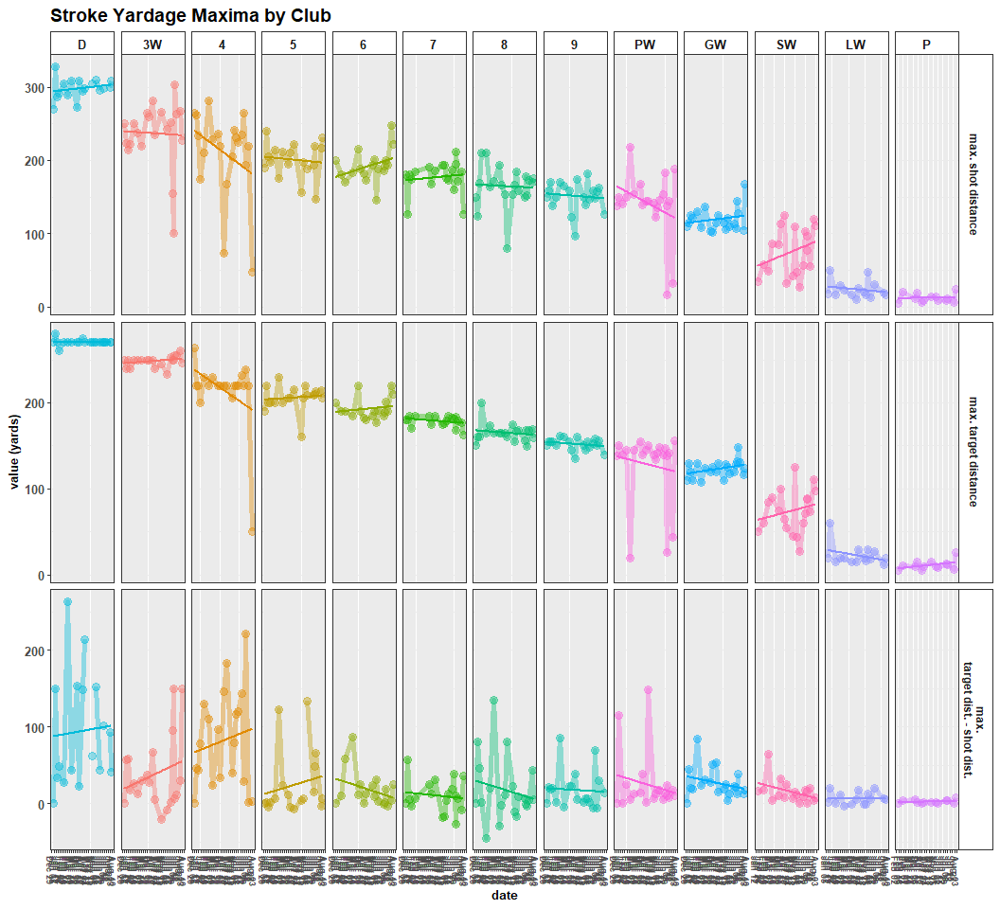
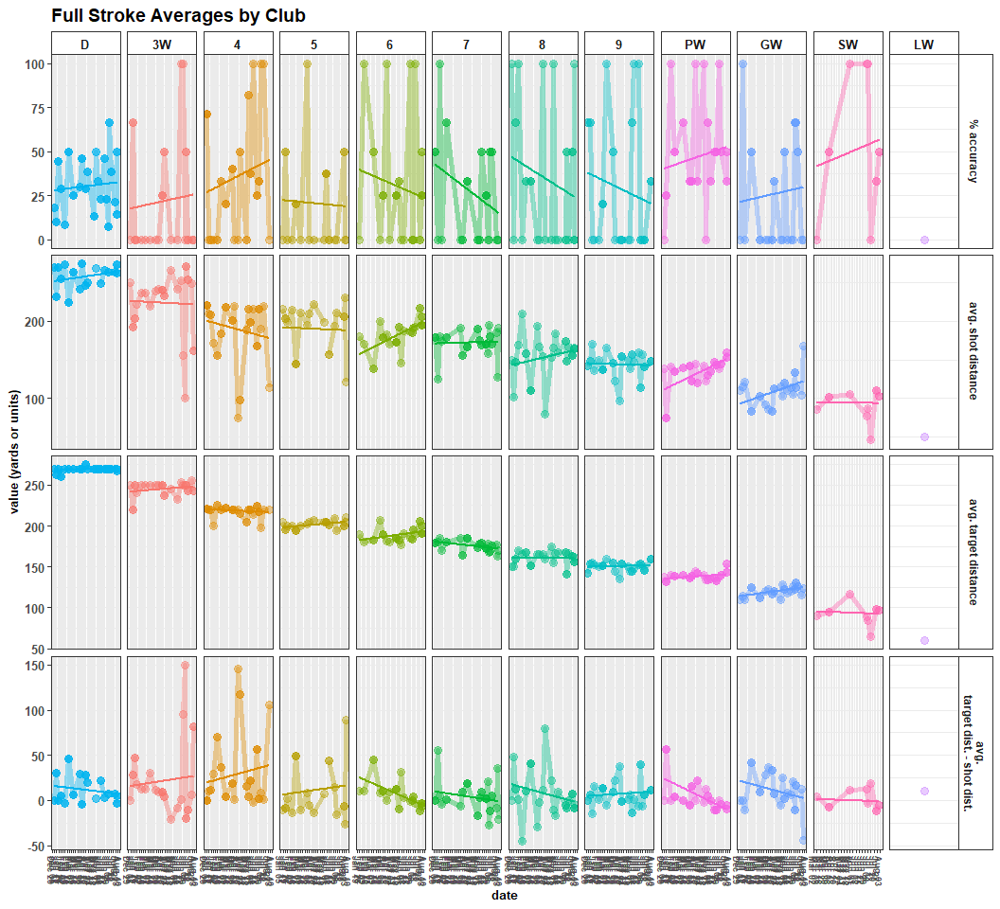
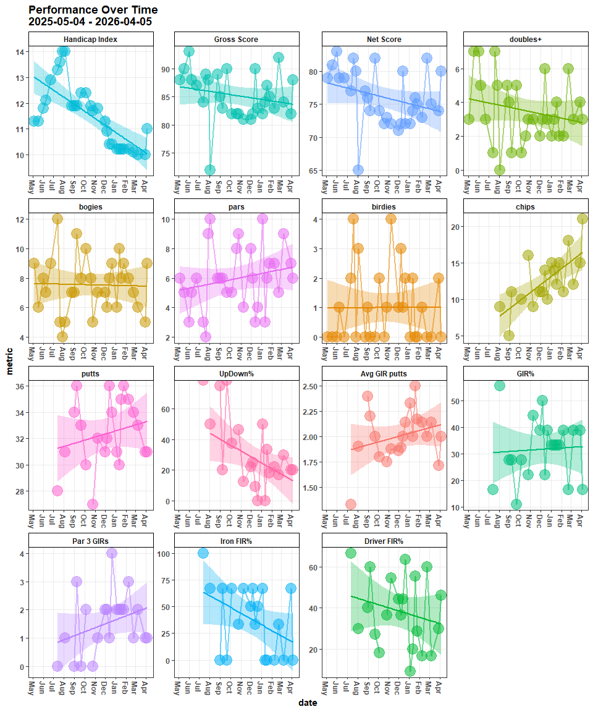

## Overview

This vignette shows the data logging process of each round and shows
trends and metric averages

## Set-up Environment

### Attach Packages

``` r
library(golf)
library(tidyverse)
library(lme4)
library(mgcv)
library(brms)
library(DBI)
library(RSQLite)
# library(blastula)
# library(keyring)
# library(mailR)
library(emayili)
```

## Record New Scorecard

### Input the Scores Data

``` r
round_course <- 'Randolph North'
round_date <- '2026-04-05'
round_tees <- 'blue'

hole_scores <- c(4, 6, 5, 5, 5, 4, 6, 4, 6,
                 5, 3, 5, 5, 4, 6, 6, 4, 5)

FIRs <- c(0, 0, 1, 1, 0, 0, 1, 0, 0,
          1, 0, 1, 0, 1, 0, 0, 0, 0)

GIRs <- c(0, 0, 1, rep(0, 6),
          0, 1, 0, 0, 1, rep(0, 4)) 

putts_rec <- c(1, 2, 2, 1, 2, 2, 2, 2, 1,
               2, 2, 2, 2, 2, 1, 2, 1, 2)

chips_rec <- c(1, 2, 1, 2, 1, 1, 2, 1, 3,
               1, 0, 1, 1, 0, 1, 1, 1, 1)

penalties_rec <- c(rep(0, 14), 2, 0, 0, 0)

tee_clubs <- c('4', 'D', 'D', 'D', 'D', '9', 'D', '5', 'D',
               'D', '6', 'D', 'D', 'D', '6', 'D', 'D', 'D')

index <- 11.0
```

### Specify Course and Tees

``` r
if ( length(hole_scores) > 0 ) {
 Card <- golf::get_course(course = round_course, date = round_date, tees = round_tees) 
}
```

### Get Scoring Metrics

``` r
if ( length(hole_scores) > 0 ) {
 Card <- golf::log_score(Scorecard = Card,
                       hole_by_hole = hole_scores,
                       GHIN = 10526424,
                       index = index,
                       FIR = FIRs,
                       GIR = GIRs,
                       putts = putts_rec,
                       chips = chips_rec,
                       penalties = penalties_rec,
                       tee_club = tee_clubs) 
}
```

## Update the db

### Update the Players Table

``` r
con <- golf::get_db_connection()

if ( DBI::dbGetQuery(conn = con, statement = paste0("SELECT DISTINCT date FROM rounds ORDER BY date DESC LIMIT 1;")) |> 
     dplyr::distinct(date) |> 
     unlist() %>% 
     lubridate::as_date(.) |> 
     as.character() < round_date &
     
     length(hole_scores) > 0
     ) {

  DBI::dbAppendTable(conn = con,
                   name = 'players',
                   value = players <- Card |> 
                     dplyr::select(GHIN, index, date) |> 
                     dplyr::distinct() |> 
                     dplyr::rename(handicap_index = index)
                   )
  
}
```

### Update the Courses Table

``` r
con <- golf::get_db_connection()

if ( DBI::dbGetQuery(conn = con, statement = paste0("SELECT DISTINCT date FROM rounds ORDER BY date DESC LIMIT 1;")) |> 
     dplyr::distinct(date) |> 
     unlist() %>% 
     lubridate::as_date(.) |> 
     as.character() < round_date &
     
     length(hole_scores) > 0
     ) {
  DBI::dbAppendTable(conn = con,
                   name = 'courses',
                   value = course <- Card |> 
                     dplyr::select(course, tees, to_par, slope, course_rating, hole, yds, par, hole_handicap) |> 
                     dplyr::distinct() |> 
                     dplyr::rename(course_name = course)
                   )
}
```

### Update the Rounds Table

``` r
con <- golf::get_db_connection()

if ( DBI::dbGetQuery(conn = con, statement = paste0("SELECT DISTINCT date FROM rounds ORDER BY date DESC LIMIT 1;")) |> 
     dplyr::distinct(date) |> 
     unlist() %>% 
     lubridate::as_date(.) |> 
     as.character() < round_date &
     
     length(hole_scores) > 0
     ) {
  DBI::dbAppendTable(conn = con,
                   name = 'rounds',
                   value = Card |> 
                     dplyr::select(-to_par, -slope, -course_rating, -yds, -par) |> 
                     dplyr::distinct() |>
                     dplyr::rename(handicap_index = index) |> 
                     dplyr::rename(course_name = course)
                   )
}
```

### Get Club Metrics df

``` r
club_metrics_df <- golf::get_tracked_shots_data_shape(round_date = round_date)
```

### Annotate Club Metrics

``` r
club_choice <- c(
  '4', 'PW', 'PW',
  'D', '4', 'SW', 'LW',
  'D', '3W', 'SW',
  'D', '7', 'PW', 'P',
  'D', '8', 'PW',
  '9', 'GW',
  'D', 'PW', 'PW', 'P',
  '5', 'SW',
  'D', '6', 'SW', 'GW', 'P',
  
  'D', 'GW', 'SW',
  '6',
  'D', 'GW', 'SW',
  'D', '4', 'SW',
  'D', 'PW',
  '6', '6', 'GW',
  'D', '3W', 'SW', 'GW',
  'D', '4', 'P',
  'D', '7', 'SW'
)

dist_to_target <- c(
  220, 140, 10,
  270, 115, 30, 15,
  270, 250, 30,
  270, 175, 20, 10,
  270, 165, 13,
  145, 19,
  270, 135, 25, 15,
  205, 40,
  270, 190, 65, 21, 11,
  
  270, 125, 24,
  190,
  270, 120, 45, 
  270, 120, 90,
  270, 140,
  190, 190, 10,
  270, 250, 100, 10,
  270, 150, 5,
  270, 154, 32
)

yds <- c(
  219, 131, 8,
  308, 82, 16, 16,
  272, 260, 28,
  259, 168, 20, 10,
  255, 167, 17,
  123, 8,
  257, 97, 39, 19,
  210, 36,
  279, 165, 33, 21, 10,
  
  290, 102, 23,
  188,
  267, 69, 49,
  304, 159, 90,
  286, 139,
  180, 184, 5,
  248, 222, 114, 6,
  273, 144, 4,
  265, 142, 16
)

lie_type <- c(
  'tee', 'rough', 'fairway',
  'tee', 'rough', 'sand', 'sand',
  'tee', 'fairway', 'rough',
  'tee', 'fairway', 'fairway', 'fairway',
  'tee', 'rough', 'fairway',
  'tee', 'rough', 
  'tee', 'fairway', 'fairway', 'fairway',
  'tee', 'rough',
  'tee', 'fairway', 'rough', 'rough', 'fairway',
  
  'tee', 'rough', 'fairway',
  'tee',
  'tee', 'fairway', 'fairway',
  'tee', 'rough', 'rough',
  'tee', 'fairway', 
  'tee', 'tee', 'fairway',
  'tee', 'rough', 'rough', 'fairway',
  'tee', 'rough', 'fairway',
  'tee', 'rough', 'rough'
  
)

target_status <- c(
  'no', 'no', 'yes',
  'no', 'no', 'no', 'yes',
  'yes', 'no', 'yes',
  'yes', 'no', 'no', 'yes',
  'no', 'no', 'yes',
  'no', 'yes',
  'yes', 'no', 'no', 'yes',
  'no', 'yes',
  'yes', 'no', 'no', 'no', 'yes',
  
  'no', 'no', 'yes',
  'yes',
  'yes', 'no', 'yes',
  'no', 'no', 'yes',
  'yes', 'yes',
  'no', 'no', 'yes',
  'no', 'no', 'no', 'yes',
  'no', 'no', 'yes',
  'no', 'no', 'yes'
)

location <- c(
  'right', 'right', 'on_target',
  'left', 'short', 'short', 'on_target',
  'on_target', 'right', 'on_target',
  'on_target', 'long', 'long', 'on_target',
  'right', 'short', 'on_target',
  'short', 'on_target',
  'on_target', 'short', 'long', 'on_target',
  'long', 'on_target',
  'on_target', 'right', 'short', 'short', 'on_target',
  
  'right', 'short', 'on_target',
  'on_target',
  'on_target', 'short', 'on_target',
  'right', 'right', 'on_target',
  'on_target', 'on_target',
  'short', 'short', 'on_target',
  'right', 'right', 'long', 'on_target',
  'long', 'right', 'on_target',
  'right', 'short', 'on_target'
)

type_of_shot <- c(
  'tee', 'full', 'chip',
  'tee', 'punch', 'gsbunker', 'gsbunker',
  'tee', 'full', 'chip',
  'tee', 'full', 'chip', 'chip',
  'tee', 'full', 'chip',
  'tee', 'chip',
  'tee', 'full', 'chip', 'chip',
  'tee', 'chip',
  'tee', 'full', 'chip', 'chip', 'chip',
  
  'tee', 'full', 'chip',
  'tee',
  'tee', 'full', 'chip',
  'tee', 'punch', 'full',
  'tee', 'full',
  'tee', 'tee', 'chip',
  'tee', 'full', 'full', 'chip',
  'tee', 'punch', 'chip',
  'tee', 'full', 'chip'
)
```

### Get Shot Metrics

    ##    tracked_shots sum(tracked_shots)
    ## 1              3                 55
    ## 2              4                 55
    ## 3              3                 55
    ## 4              4                 55
    ## 5              3                 55
    ## 6              2                 55
    ## 7              4                 55
    ## 8              2                 55
    ## 9              5                 55
    ## 10             3                 55
    ## 11             1                 55
    ## 12             3                 55
    ## 13             3                 55
    ## 14             2                 55
    ## 15             3                 55
    ## 16             4                 55
    ## 17             3                 55
    ## 18             3                 55

### Update the Club Metrics Table

``` r
con <- golf::get_db_connection()

if ( DBI::dbGetQuery(conn = con, statement = paste0("SELECT DISTINCT date FROM club_metrics ORDER BY date DESC LIMIT 1;")) |> 
     dplyr::distinct(date) |> 
     unlist() %>% 
     lubridate::as_date(.) |> 
     as.character() < round_date &
     
     length(hole_scores) > 0
     ) {
  DBI::dbAppendTable(conn = con,
                   name = 'club_metrics',
                   value = club_metrics
                   )
}
```

``` r
rm(list = ls()[which(grepl(ls(), pattern= 'con|round_course|round_date|index')==F)])
```

## Summarize Metrics

### Gather and Format

Gather and format from the database

``` r
con <- golf::get_db_connection()

scores <- DBI::dbGetQuery(conn = con, statement = paste0(
  "SELECT DISTINCT sub.* FROM
  (SELECT DISTINCT r.*, c.par, c.course_rating FROM rounds r
  LEFT JOIN courses c
  ON c.tees = r.tees
  AND c.course_name = r.course_name
  AND c.hole = r.hole
  AND c.hole_handicap = r.hole_handicap) AS sub
  INNER JOIN players p
  ON sub.GHIN = p.GHIN
  AND sub.handicap_index = p.handicap_index
  AND sub.date = p.date;"
)) |> 
  dplyr::mutate(date = lubridate::as_date(date),
                hole = stringr::str_extract(hole, pattern = '[0-9]{1,}') |> 
                  as.numeric()) |> 
  dplyr::relocate(par, .after = hole) |> 
  dplyr::relocate(course_rating, .after = tees) |>
  dplyr::group_by(date) |> 
  dplyr::arrange(desc(date), hole) |> 
  dplyr::ungroup()
```

``` r
con <- golf::get_db_connection()

stroke_quality <- DBI::dbGetQuery(conn = con, statement = paste0(
  "SELECT DISTINCT * FROM club_metrics;"
)) |> 
  dplyr::mutate(date = lubridate::as_date(date),
                hole = stringr::str_extract(hole, pattern = '[0-9]{1,}') |> 
                  as.numeric()) |> 
  dplyr::group_by(date) |> 
  dplyr::arrange(desc(date), hole, stroke) |> 
  dplyr::ungroup()
```

### Compute Advanced Metrics

Compute more nuanced metrics

``` r
scores_sum <- scores |>
  dplyr::mutate(date_course = paste0(date,
                                     '\n',
                                     course_name, '\n',
                                     handicap_index),
                chips = dplyr::case_when(
                  grepl(date, pattern = '07-13') ~ NA_real_, TRUE ~ chips),
                `chips+putts` = chips+putts,
                FIR_opps = dplyr::case_when(par > 3 ~ 1, TRUE ~ NA),
                `Iron FIRs` = dplyr::case_when(par > 3 &
                                                 grepl(tee_club, pattern = '4|5') &
                                                 FIR == 1 ~ 1,
                                               TRUE ~ 0),
                `Iron FIR opps` = dplyr::case_when(par > 3 &
                                                     grepl(tee_club, pattern = '4|5') ~ 1,
                                                   TRUE ~ 0),
                `Driver FIRs` = dplyr::case_when(par > 3 &
                                                   tee_club == 'D' &
                                                   FIR == 1 ~ 1,
                                                 TRUE ~ 0),
                `Driver FIR opps` = dplyr::case_when(par > 3 &
                                                     tee_club == 'D' ~ 1,
                                                   TRUE ~ 0),
                `Par 3 GIRs` = dplyr::case_when(par == 3 & 
                                                  GIR == 1 ~ 1,
                                                TRUE ~ 0),
                greenie_putts = dplyr::case_when(GIR == 1 ~ putts, TRUE ~ NA_real_),
                updown_conv = dplyr::case_when(GIR == 0 &
                                                 par == gross ~ 1,
                                               TRUE ~ 0),
                updown_opps = dplyr::case_when(GIR == 0 &
                                                chips > 0 ~ 1,
                                              TRUE ~ 0)
                ) |> 
  dplyr::rename(`Handicap Index` = handicap_index) |> 
  dplyr::group_by(date, date_course, course_rating, `Handicap Index`) |> 
  dplyr::summarize(
                   FIRs = sum(FIR, na.rm = F),
                   `Iron FIRs` = sum(`Iron FIRs`, na.rm = T),
                   `Iron FIR%` = round(((sum(`Iron FIRs`, na.rm = T)/sum(`Iron FIR opps`, na.rm = T))*100), 1),
                   `Driver FIRs` = sum(`Driver FIRs`, na.rm = T),
                   `Driver FIR%` = round(((sum(`Driver FIRs`, na.rm = T)/sum(`Driver FIR opps`, na.rm = T))*100), 1),
                   `FIR%` = round((sum(FIRs, na.rm = T)/sum(FIR_opps, na.rm = T))*100, 1),
                   GIRs = sum(GIR, na.rm = F),
                   `Par 3 GIRs` = sum(`Par 3 GIRs`, na.rm = T),
                   `GIR%` = round((sum(GIRs, na.rm = T)/18)*100, 1),
                   putts = sum(putts, na.rm = F),
                   `Avg GIR putts` = round(mean(greenie_putts, na.rm = T), 2),
                   chips = sum(chips, na.rm = F),
                   `chips+putts` = sum(`chips+putts`, na.rm = F),
                   `UpDown%` = round(((sum(updown_conv, na.rm = T)/sum(updown_opps, na.rm = T))*100), 1),
                   pars = sum(is_gross_par, na.rm = F),
                   birdies = sum(is_gross_birdie, na.rm = F),
                   bogies = sum(is_gross_bogey, na.rm = F),
                   `doubles+` = sum(is_gross_bogey_worse, na.rm = F),
                   penalties = sum(penalties, na.rm = T),
                   `Gross Score` = mean(tot_gross, na.rm = F),
                   `Net Score` = mean(tot_net, na.rm = F)) %>%
  dplyr::mutate(dplyr::across(c(`Iron FIRs`, `Driver FIRs`, `Iron FIR%`, `Driver FIR%`, `FIR%`), ~dplyr::if_else(is.na(FIRs), NA, .)),
                dplyr::across(c(`Par 3 GIRs`, `Avg GIR putts`, `UpDown%`, `GIR%`), ~dplyr::if_else(is.na(GIRs), NA, .)),
                `chips+putts` = dplyr::case_when(is.na(chips) ~ NA_real_,
                                                 TRUE ~ `chips+putts`)) %>% 
  dplyr::mutate(`UpAndDown%` = dplyr::case_when(grepl(date, pattern = '07-13|09-21') ~ NA, TRUE ~ `UpDown%`),
                `Iron FIR%` = dplyr::case_when(`Iron FIR%` == NaN ~ 0.0, TRUE ~ `Iron FIR%`))
```

``` r
head(scores_sum |> 
       dplyr::arrange(desc(date)))
```

    ## # A tibble: 6 × 26
    ## # Groups:   date, date_course, course_rating [6]
    ##   date       date_course                        course_rating `Handicap Index`  FIRs `Iron FIRs` `Iron FIR%` `Driver FIRs` `Driver FIR%` `FIR%`  GIRs `Par 3 GIRs` `GIR%` putts `Avg GIR putts` chips `chips+putts` `UpDown%`  pars birdies bogies `doubles+` penalties `Gross Score` `Net Score` `UpAndDown%`
    ##   <date>     <chr>                                      <dbl>            <dbl> <int>       <dbl>       <dbl>         <dbl>         <dbl>  <dbl> <int>        <dbl>  <dbl> <int>           <dbl> <dbl>         <dbl>     <dbl> <int>   <int>  <int>      <int>     <int>         <dbl>       <dbl>        <dbl>
    ## 1 2026-04-05 "2026-04-05\nRandolph North\n11"            71.7             11       6           0         0               6          46.2   42.9     3            1   16.7    31            2       21            52      20       6       0      9          3         2            88          80         20  
    ## 2 2026-03-29 "2026-03-29\nDell Urich\n10"                70.3             10       5           2        66.7             3          30     38.5     7            1   38.9    31            1.71    15            46      20       7       2      5          4         1            82          74         20  
    ## 3 2026-03-08 "2026-03-08\nRandolph North\n10"            71.7             10       2           0         0               2          16.7   14.3     7            2   38.9    33            2.14    12            45      30       9       0      6          3         1            84          75         30  
    ## 4 2026-02-22 "2026-02-22\nDell Urich\n10.1"              68               10.1     7           1        33.3             6          60     53.8     3            1   16.7    34            2       18            52      16.7     5       0      7          6         0            92          82         16.7
    ## 5 2026-02-08 "2026-02-08\nRandolph North\n10.2"          70               10.2     2           0         0               2          16.7   14.3     7            3   38.9    35            2.14    11            46      22.2     7       1      8          2         0            83          73         22.2
    ## 6 2026-01-25 "2026-01-25\nRandolph North\n10.2"          70               10.2     4           0       NaN               4          28.6   28.6     6            2   33.3    36            2.17    15            51      18.2     7       0      9          2         0            85          75         18.2

### View Metrics

Separate and view metrics

#### Scoring Metrics

Scores and Handicap

``` r
scoring_metrics <- scores_sum |> 
  dplyr::select(`Handicap Index`, `Gross Score`, `Net Score`)
head(scoring_metrics |> 
       dplyr::arrange(desc(date)))
```

    ## # A tibble: 6 × 6
    ## # Groups:   date, date_course, course_rating [6]
    ##   date       date_course                        course_rating `Handicap Index` `Gross Score` `Net Score`
    ##   <date>     <chr>                                      <dbl>            <dbl>         <dbl>       <dbl>
    ## 1 2026-04-05 "2026-04-05\nRandolph North\n11"            71.7             11              88          80
    ## 2 2026-03-29 "2026-03-29\nDell Urich\n10"                70.3             10              82          74
    ## 3 2026-03-08 "2026-03-08\nRandolph North\n10"            71.7             10              84          75
    ## 4 2026-02-22 "2026-02-22\nDell Urich\n10.1"              68               10.1            92          82
    ## 5 2026-02-08 "2026-02-08\nRandolph North\n10.2"          70               10.2            83          73
    ## 6 2026-01-25 "2026-01-25\nRandolph North\n10.2"          70               10.2            85          75

#### Stroke Metrics

Pars, birdies, bogies, etc.

``` r
stroke_metrics <- scores_sum |> 
  dplyr::select(`doubles+`, bogies, pars, birdies)
head(stroke_metrics |> 
       dplyr::arrange(desc(date)))
```

    ## # A tibble: 6 × 7
    ## # Groups:   date, date_course, course_rating [6]
    ##   date       date_course                        course_rating `doubles+` bogies  pars birdies
    ##   <date>     <chr>                                      <dbl>      <int>  <int> <int>   <int>
    ## 1 2026-04-05 "2026-04-05\nRandolph North\n11"            71.7          3      9     6       0
    ## 2 2026-03-29 "2026-03-29\nDell Urich\n10"                70.3          4      5     7       2
    ## 3 2026-03-08 "2026-03-08\nRandolph North\n10"            71.7          3      6     9       0
    ## 4 2026-02-22 "2026-02-22\nDell Urich\n10.1"              68            6      7     5       0
    ## 5 2026-02-08 "2026-02-08\nRandolph North\n10.2"          70            2      8     7       1
    ## 6 2026-01-25 "2026-01-25\nRandolph North\n10.2"          70            2      9     7       0

#### Around-the-Green Metrics

Chips, putts, etc.

``` r
atg_metrics <- scores_sum |> 
  dplyr::select(chips, `chips+putts`, `UpAndDown%`, putts, `Avg GIR putts`)
head(atg_metrics |> 
       dplyr::arrange(desc(date)))
```

    ## # A tibble: 6 × 8
    ## # Groups:   date, date_course, course_rating [6]
    ##   date       date_course                        course_rating chips `chips+putts` `UpAndDown%` putts `Avg GIR putts`
    ##   <date>     <chr>                                      <dbl> <dbl>         <dbl>        <dbl> <int>           <dbl>
    ## 1 2026-04-05 "2026-04-05\nRandolph North\n11"            71.7    21            52         20      31            2   
    ## 2 2026-03-29 "2026-03-29\nDell Urich\n10"                70.3    15            46         20      31            1.71
    ## 3 2026-03-08 "2026-03-08\nRandolph North\n10"            71.7    12            45         30      33            2.14
    ## 4 2026-02-22 "2026-02-22\nDell Urich\n10.1"              68      18            52         16.7    34            2   
    ## 5 2026-02-08 "2026-02-08\nRandolph North\n10.2"          70      11            46         22.2    35            2.14
    ## 6 2026-01-25 "2026-01-25\nRandolph North\n10.2"          70      15            51         18.2    36            2.17

#### Ball Striking Metrics

Approach and tee accuracy

``` r
ball_striking_metrics <- scores_sum |> 
  dplyr::select(GIRs, `GIR%`, `Par 3 GIRs`,
                FIRs, `FIR%`, `Iron FIRs`, `Iron FIR%`,
                `Driver FIRs`, `Driver FIR%`)
head(ball_striking_metrics |> 
       dplyr::arrange(desc(date)))
```

    ## # A tibble: 6 × 12
    ## # Groups:   date, date_course, course_rating [6]
    ##   date       date_course                        course_rating  GIRs `GIR%` `Par 3 GIRs`  FIRs `FIR%` `Iron FIRs` `Iron FIR%` `Driver FIRs` `Driver FIR%`
    ##   <date>     <chr>                                      <dbl> <int>  <dbl>        <dbl> <int>  <dbl>       <dbl>       <dbl>         <dbl>         <dbl>
    ## 1 2026-04-05 "2026-04-05\nRandolph North\n11"            71.7     3   16.7            1     6   42.9           0         0               6          46.2
    ## 2 2026-03-29 "2026-03-29\nDell Urich\n10"                70.3     7   38.9            1     5   38.5           2        66.7             3          30  
    ## 3 2026-03-08 "2026-03-08\nRandolph North\n10"            71.7     7   38.9            2     2   14.3           0         0               2          16.7
    ## 4 2026-02-22 "2026-02-22\nDell Urich\n10.1"              68       3   16.7            1     7   53.8           1        33.3             6          60  
    ## 5 2026-02-08 "2026-02-08\nRandolph North\n10.2"          70       7   38.9            3     2   14.3           0         0               2          16.7
    ## 6 2026-01-25 "2026-01-25\nRandolph North\n10.2"          70       6   33.3            2     4   28.6           0       NaN               4          28.6

#### Club Metrics

Yardage and accuracy for each club

    ## # A tibble: 6 × 6
    ## # Groups:   date [1]
    ##   date       club      n rd_min_yds_to_target rd_min_yds_traveled rd_min_yd_diff
    ##   <date>     <chr> <int>                <dbl>               <dbl>          <dbl>
    ## 1 2026-04-05 3W        2                  250                 222            -10
    ## 2 2026-04-05 4         4                  115                  82            -39
    ## 3 2026-04-05 5         1                  205                 210             -5
    ## 4 2026-04-05 6         4                  190                 165              2
    ## 5 2026-04-05 7         2                  154                 142              7
    ## 6 2026-04-05 8         1                  165                 167             -2

    ## # A tibble: 6 × 6
    ## # Groups:   date [1]
    ##   date       club      n rd_max_yds_to_target rd_max_yds_traveled rd_max_yd_diff
    ##   <date>     <chr> <int>                <dbl>               <dbl>          <dbl>
    ## 1 2026-04-05 3W        2                  250                 260             28
    ## 2 2026-04-05 4         4                  220                 219             33
    ## 3 2026-04-05 5         1                  205                 210             -5
    ## 4 2026-04-05 6         4                  190                 188             25
    ## 5 2026-04-05 7         2                  175                 168             12
    ## 6 2026-04-05 8         1                  165                 167             -2

    ## # A tibble: 6 × 10
    ## # Groups:   date [1]
    ##   date       club  `rd club strokes` miss_direction `rd club miss dir` rd_avg_yds_to_target rd_avg_yds_traveled rd_avg_yd_diff rd_avg_accuracy `rd club % miss direction`
    ##   <date>     <chr>             <int> <chr>                       <int>                <dbl>               <dbl>          <dbl>           <dbl>                      <dbl>
    ## 1 2026-04-05 3W                    2 right                           2                 250                 241             9                 0                        100
    ## 2 2026-04-05 4                     4 right                           3                 151.                151             0.2               0                         75
    ## 3 2026-04-05 4                     4 short                           1                 151.                151             0.2               0                         25
    ## 4 2026-04-05 5                     1 long                            1                 205                 210            -5                 0                        100
    ## 5 2026-04-05 6                     4 on_target                       1                 190                 179.           10.8              25                         25
    ## 6 2026-04-05 6                     4 right                           1                 190                 179.           10.8              25                         25

## Plot Metric Summaries

### Scoring Metrics

``` r
scoring_metrics |> 
  dplyr::mutate(course_rating = dplyr::case_when(grepl(date_course, pattern = 'Sewailo') ~ 68.9, TRUE ~ course_rating),
                `Handicap Index` = `Handicap Index`*4.5) |>
  dplyr::rename(`Course Rating` = course_rating) |> 
  dplyr::group_by(date, date_course, `Handicap Index`) |> 
  tidyr::pivot_longer(cols = c(`Course Rating`:`Net Score`), names_to = 'metric', values_to = 'value', values_drop_na = F) |> 
  ggplot2::ggplot(aes(x = date_course, y = value)) +
  ggplot2::geom_point(aes(x = date, y = value, size = 4, alpha = 0.1,
                          color = factor(metric,
                                         levels = c('Handicap Index', 'Course Rating', 'Gross Score', 'Net Score')),
                          fill = factor(metric,
                                         levels = c('Handicap Index', 'Course Rating', 'Gross Score', 'Net Score')))) +
  ggplot2::geom_line(aes(x = date, y = value, size = 1, alpha = 0.1,
                          color = factor(metric,
                                         levels = c('Handicap Index', 'Course Rating', 'Gross Score', 'Net Score')),
                          fill = factor(metric,
                                         levels = c('Handicap Index', 'Course Rating', 'Gross Score', 'Net Score')))) +
  ggplot2::geom_smooth(aes(x = date, y = value, group = metric,
                           color = factor(metric,
                                          levels = c('Handicap Index', 'Course Rating', 'Gross Score', 'Net Score')),
                           fill = factor(metric,
                                         levels = c('Handicap Index', 'Course Rating', 'Gross Score', 'Net Score'))),
                       alpha = 0.3, method = 'lm') +
  ggplot2::scale_y_continuous(sec.axis = ggplot2::sec_axis(~./4.5, name = 'Handicap Index'))+
  ggplot2::labs(title = paste0('Performance Over Time\n',
                               scores |> 
                                 dplyr::distinct(date) |> 
                                 dplyr::last() |> 
                                 unlist() %>% lubridate::as_date(.) |> 
                                 as.character(),
                               ' - ',
                               scores |> 
                                 dplyr::distinct(date) |> 
                                 dplyr::first() |> 
                                 unlist() %>% lubridate::as_date(.) |> 
                                 as.character()),
                x = 'date',
                y = 'metric',
                color = 'metric'
                ) +
  ggplot2::guides(alpha = 'none', size = 'none', fill = 'none') +
  ggplot2::theme_bw() +
  ggplot2::theme(panel.grid.minor = ggplot2::element_blank(),
                 axis.title = ggplot2::element_text(face = 'bold'),
                 axis.text.y = ggplot2::element_text(face = 'bold'),
                 axis.text.x = ggplot2::element_text(face = 'bold', angle = 0, hjust = 0, vjust = 0),
                 title = ggplot2::element_text(face = 'bold')
                 ) +
  ggplot2::scale_x_date(date_breaks = '1 month', date_labels = '%b')
```

<!-- -->

### Stroke Metrics

``` r
stroke_metrics |> 
  tidyr::pivot_longer(cols = c(`doubles+`:birdies), names_to = 'metric', values_to = 'value', values_drop_na = F) |> 
  ggplot2::ggplot(aes(x = date_course, y = value, group = metric, color = metric, fill = metric)) +
  ggplot2::geom_point(aes(x = date, y = value, size = 4, alpha = 0.1), na.rm = T) +
  ggplot2::geom_line(aes(x = date, y = value, size = 1, alpha = 0.1), na.rm = T) +
  ggplot2::geom_smooth(aes(x = date, y = value), alpha = 0.3, method = 'lm') +
  ggplot2::labs(title = paste0('Hole-by-Hole Scores Over Time\n',
                               scores |> 
                                 dplyr::distinct(date) |> 
                                 dplyr::last() |> 
                                 unlist() %>% lubridate::as_date(.) |> 
                                 as.character(),
                               ' - ',
                               scores |> 
                                 dplyr::distinct(date) |> 
                                 dplyr::first() |> 
                                 unlist() %>% lubridate::as_date(.) |> 
                                 as.character()),
                x = 'date',
                y = 'metric',
                color = 'metric', fill = 'metric') +
  ggplot2::guides(alpha = 'none', size = 'none') +
  ggplot2::theme_bw() +
  ggplot2::theme(legend.position = 'none',
                 panel.grid.minor = ggplot2::element_blank(),
                 axis.title = ggplot2::element_text(face = 'bold'),
                 axis.text.y = ggplot2::element_text(face = 'bold'),
                 axis.text.x = ggplot2::element_text(face = 'bold', angle = 270, hjust = 0, vjust = 0.5),
                 title = ggplot2::element_text(face = 'bold'),
                 strip.text.x.top = ggplot2::element_text(face = 'bold'),
                 strip.background = ggplot2::element_rect(color = 'black', 
                                                          fill = 'white')) +
  ggplot2::scale_x_date(date_breaks = '1 month', date_labels = '%b') +
  ggplot2::facet_wrap(~factor(metric, levels = c('doubles+', 'bogies', 'pars', 'birdies')), nrow = 1)
```

<!-- -->

### Around the Green Metrics

``` r
atg_metrics |> 
  tidyr::pivot_longer(cols = c(chips:`Avg GIR putts`), names_to = 'metric', values_to = 'value', values_drop_na = F) |> 
  ggplot2::ggplot(aes(x = date_course, y = value, group = metric, color = metric, fill = metric)) +
  ggplot2::geom_point(aes(x = date, y = value, size = 4, alpha = 0.1), na.rm = T) +
  ggplot2::geom_line(aes(x = date, y = value, size = 1, alpha = 0.1), na.rm = T) +
  ggplot2::geom_smooth(aes(x = date, y = value), alpha = 0.3, method = 'lm') +
  ggplot2::labs(title = paste0('Around the Green Metrics Over Time\n',
                               scores |> 
                                 dplyr::distinct(date) |> 
                                 dplyr::last() |> 
                                 unlist() %>% lubridate::as_date(.) |> 
                                 as.character(),
                               ' - ',
                               scores |> 
                                 dplyr::distinct(date) |> 
                                 dplyr::first() |> 
                                 unlist() %>% lubridate::as_date(.) |> 
                                 as.character()),
                x = 'date',
                y = 'metric',
                color = 'metric', fill = 'metric') +
  ggplot2::guides(alpha = 'none', size = 'none') +
  ggplot2::theme_bw() +
  ggplot2::theme(legend.position = 'none',
                 panel.grid.minor = ggplot2::element_blank(),
                 axis.title = ggplot2::element_text(face = 'bold'),
                 axis.text.y = ggplot2::element_text(face = 'bold'),
                 axis.text.x = ggplot2::element_text(face = 'bold', angle = 270, hjust = 0, vjust = 0.5),
                 title = ggplot2::element_text(face = 'bold'),
                 strip.text.x.top = ggplot2::element_text(face = 'bold'),
                 strip.background = ggplot2::element_rect(color = 'black', 
                                                          fill = 'white')) +
  ggplot2::scale_x_date(date_breaks = '1 month', date_labels = '%b') +
  ggplot2::facet_wrap(~factor(metric, levels = c('chips', 'putts', 'chips+putts', 'UpAndDown%', 'Avg GIR putts')), scales = 'free')
```

<!-- -->

### Ball Striking Metrics

``` r
ball_striking_metrics |> 
  tidyr::pivot_longer(cols = c(GIRs:`Driver FIR%`), names_to = 'metric', values_to = 'value', values_drop_na = F) |> 
  ggplot2::ggplot(aes(x = date_course, y = value, group = metric, color = metric, fill = metric)) +
  ggplot2::geom_point(aes(x = date, y = value, size = 4, alpha = 0.1), na.rm = T) +
  ggplot2::geom_line(aes(x = date, y = value, size = 1, alpha = 0.1), na.rm = T) +
  ggplot2::geom_smooth(aes(x = date, y = value), alpha = 0.3, method = 'lm') +
  ggplot2::labs(title = paste0('Ball Striking Over Time\n',
                               scores |> 
                                 dplyr::distinct(date) |> 
                                 dplyr::last() |> 
                                 unlist() %>% lubridate::as_date(.) |> 
                                 as.character(),
                               ' - ',
                               scores |> 
                                 dplyr::distinct(date) |> 
                                 dplyr::first() |> 
                                 unlist() %>% lubridate::as_date(.) |> 
                                 as.character()),
                x = 'date',
                y = 'metric',
                color = 'metric', fill = 'metric') +
  ggplot2::guides(alpha = 'none', size = 'none') +
  ggplot2::theme_bw() +
  ggplot2::theme(legend.position = 'none',
                 panel.grid.minor = ggplot2::element_blank(),
                 axis.title = ggplot2::element_text(face = 'bold'),
                 axis.text.y = ggplot2::element_text(face = 'bold'),
                 axis.text.x = ggplot2::element_text(face = 'bold', angle = 270, hjust = 0, vjust = 0.5),
                 title = ggplot2::element_text(face = 'bold'),
                 strip.text.x.top = ggplot2::element_text(face = 'bold'),
                 strip.background = ggplot2::element_rect(color = 'black', 
                                                          fill = 'white')) +
  ggplot2::scale_x_date(date_breaks = '1 month', date_labels = '%b') +
  ggplot2::facet_wrap(~factor(metric,levels = c('Driver FIRs', 'Iron FIRs', 'FIRs',
                                                'Driver FIR%', 'Iron FIR%', 'FIR%',
                                                'GIRs', 'Par 3 GIRs', 'GIR%')), scales = 'free')
```

<!-- -->

### Stroke Quality Metrics

#### Minima

``` r
stroke_quality_min |> 
  dplyr::ungroup() %>%
  dplyr::mutate(dplyr::across(c(date:n), ~as.character(.x))) |> 
  tidyr::pivot_longer(cols = c(dplyr::contains('yd')), names_to = 'metric', values_to = 'vals') |> 
  dplyr::mutate(metric = dplyr::case_when(grepl(metric, pattern = 'target') ~ 'min. target distance',
                                          grepl(metric, pattern = 'traveled') ~ 'min. shot distance',
                                          grepl(metric, pattern = 'diff') ~ 'min.\ntarget dist. - shot dist.')) |> 
  dplyr::mutate(date = lubridate::as_date(date),
                club = as.character(club),
                n = as.integer(n)) |> 
  ggplot2::ggplot(aes(x = date, y = vals, group = metric, color = club, fill = club)) +
  ggplot2::geom_point(alpha = 0.4, size = 3) +
  ggplot2::geom_line(alpha = 0.4, size = 2) +
  ggplot2::geom_smooth(method = 'lm', se = F) +
  ggplot2::labs(title = 'Stroke Yardage Minima by Club', x = 'date', y = 'value (yards)', fill = 'club') +
  ggplot2::guides(alpha = 'none', size = 'none') +
  ggplot2::theme_bw() +
  ggplot2::theme(title = ggplot2::element_text(face = 'bold', size = 12),
                 axis.title = ggplot2::element_text(face = 'bold', size = 10),
                 axis.text = ggplot2::element_text(face = 'bold', size = 10),
                 axis.text.x = ggplot2::element_text(face = 'bold', size = 7, angle = 270, hjust = 0, vjust = 0.5),
                 legend.position = 'none',
                 strip.background = ggplot2::element_rect(fill = 'white'),
                 strip.text.y.right = ggplot2::element_text(face = 'bold', size = 9),
                 strip.text.x.top = ggplot2::element_text(face = 'bold', size = 10)) + 
  ggplot2::scale_x_date(date_breaks = 'weeks', date_labels = '%b %d') +
  ggplot2::facet_grid(rows = vars(metric), cols = vars(factor(club,
                                                              levels = 
                                                                c('D', '3W', '4',
                                                               '5', '6', '7',
                                                               '8', '9', 'PW',
                                                               'GW', 'SW', 'LW',
                                                               'P'))),
                      scales = 'free')
```

<!-- -->

#### Maxima

``` r
stroke_quality_max |> 
  dplyr::ungroup() %>%
  dplyr::mutate(dplyr::across(c(date:n), ~as.character(.x))) |> 
  tidyr::pivot_longer(cols = c(dplyr::contains('yd')), names_to = 'metric', values_to = 'vals') |> 
  dplyr::mutate(metric = dplyr::case_when(grepl(metric, pattern = 'target') ~ 'max. target distance',
                                          grepl(metric, pattern = 'traveled') ~ 'max. shot distance',
                                          grepl(metric, pattern = 'diff') ~ 'max.\ntarget dist. - shot dist.')) |> 
  dplyr::mutate(date = lubridate::as_date(date),
                club = as.character(club),
                n = as.integer(n)) |> 
  ggplot2::ggplot(aes(x = date, y = vals, group = metric, color = club, fill = club)) +
  ggplot2::geom_point(alpha = 0.4, size = 3) +
  ggplot2::geom_line(alpha = 0.4, size = 2) +
  ggplot2::geom_smooth(method = 'lm', se = F) +
  ggplot2::labs(title = 'Stroke Yardage Maxima by Club', x = 'date', y = 'value (yards)', fill = 'club') +
  ggplot2::guides(alpha = 'none', size = 'none') +
  ggplot2::theme_bw() +
  ggplot2::theme(title = ggplot2::element_text(face = 'bold', size = 12),
                 axis.title = ggplot2::element_text(face = 'bold', size = 10),
                 axis.text = ggplot2::element_text(face = 'bold', size = 10),
                 axis.text.x = ggplot2::element_text(face = 'bold', size = 7, angle = 270, hjust = 0, vjust = 0.5),
                 legend.position = 'none',
                 strip.background = ggplot2::element_rect(fill = 'white'),
                 strip.text.y.right = ggplot2::element_text(face = 'bold', size = 9),
                 strip.text.x.top = ggplot2::element_text(face = 'bold', size = 10)) + 
  ggplot2::scale_x_date(date_breaks = 'weeks', date_labels = '%b %d') +
  ggplot2::facet_grid(rows = vars(metric), cols = vars(factor(club,
                                                              levels = 
                                                                c('D', '3W', '4',
                                                               '5', '6', '7',
                                                               '8', '9', 'PW',
                                                               'GW', 'SW', 'LW',
                                                               'P'))),
                      scales = 'free')
```

<!-- -->

#### Average

``` r
stroke_quality_avg |> 
  dplyr::ungroup() %>%
  dplyr::mutate(dplyr::across(dplyr::everything(), ~as.character(.x))) |> 
  tidyr::pivot_longer(cols = c(dplyr::contains("rd")), names_to = 'metric', values_to = 'vals') |> 
  dplyr::mutate(metric = dplyr::case_when(grepl(metric, pattern = 'target') ~ 'avg. target distance',
                                          grepl(metric, pattern = 'traveled') ~ 'avg. shot distance',
                                          grepl(metric, pattern = 'diff') ~ 'avg.\ntarget dist. - shot dist.',
                                          # grepl(metric, pattern = 'accuracy') ~ 'avg\naccuracy',
                                          grepl(metric, pattern = 'strokes') ~ 'n strokes',
                                          grepl(metric, pattern = 'dir') ~ 'strokes w/club\nin round\nby direction',
                                          grepl(metric, pattern = 'acc') ~ '% accuracy')) |> 
  dplyr::filter(!grepl(metric, pattern = 'strokes')) |>
  dplyr::mutate(date = lubridate::as_date(date),
                club = as.character(club),
                vals = as.numeric(vals)
                ) |> 
  ggplot2::ggplot(aes(x = date, y = vals, group = metric, color = club, fill = club)) +
  ggplot2::geom_point(alpha = 0.4, size = 3) +
  ggplot2::geom_line(alpha = 0.4, size = 2) +
  ggplot2::geom_smooth(method = 'lm', se = F) +
  ggplot2::labs(title = 'Stroke Averages by Club', x = 'date', y = 'value (yards or units)', fill = 'club') +
  ggplot2::guides(alpha = 'none', size = 'none') +
  ggplot2::theme_bw() +
  ggplot2::theme(title = ggplot2::element_text(face = 'bold', size = 12),
                 axis.title = ggplot2::element_text(face = 'bold', size = 10),
                 axis.text = ggplot2::element_text(face = 'bold', size = 10),
                 axis.text.x = ggplot2::element_text(face = 'bold', size = 7, angle = 270, hjust = 0, vjust = 0.5),
                 legend.position = 'none',
                 strip.background = ggplot2::element_rect(fill = 'white'),
                 strip.text.y.right = ggplot2::element_text(face = 'bold', size = 9),
                 strip.text.x.top = ggplot2::element_text(face = 'bold', size = 10)) + 
  ggplot2::scale_x_date(date_breaks = 'weeks', date_labels = '%b %d') +
  ggplot2::facet_grid(rows = vars(metric),
                      cols = vars(factor(club,
                                         levels = c('D', '3W', '4', '5', '6',
                                                    '7', '8', '9', 'PW', 'GW',
                                                    'SW', 'LW', 'P'))),
                      scales = 'free')
```

<!-- -->

### Main Metrics

``` r
scores_sum |> 
  dplyr::mutate(course_rating = dplyr::case_when(grepl(date_course, pattern = 'Sewailo') ~ 68.9, TRUE ~ course_rating)) |> 
  tidyr::pivot_longer(cols = c(`Handicap Index`, `Gross Score`, `Net Score`,
                               `doubles+`, bogies, pars, birdies, chips, putts,
                               `UpDown%`,`Avg GIR putts`, `GIR%`, `Par 3 GIRs`,
                               `Iron FIR%`, `Driver FIR%`), names_to = 'metric', values_to = 'value', values_drop_na = F) |> 
  ggplot2::ggplot(aes(x = date_course, y = value, group = metric, color = metric, fill = metric)) +
  ggplot2::geom_point(aes(x = date, y = value, size = 4, alpha = 0.1), na.rm = T) +
  ggplot2::geom_line(aes(x = date, y = value, size = 1, alpha = 0.1), na.rm = T) +
  ggplot2::geom_smooth(aes(x = date, y = value), alpha = 0.3, method = 'lm') +
  ggplot2::labs(title = paste0('Performance Over Time\n',
                               scores |> 
                                 dplyr::distinct(date) |> 
                                 dplyr::last() |> 
                                 unlist() %>% lubridate::as_date(.) |> 
                                 as.character(),
                               ' - ',
                               scores |> 
                                 dplyr::distinct(date) |> 
                                 dplyr::first() |> 
                                 unlist() %>% lubridate::as_date(.) |> 
                                 as.character()),
                x = 'date',
                y = 'metric',
                color = 'metric', fill = 'metric') +
  ggplot2::guides(alpha = 'none', size = 'none') +
  ggplot2::theme_bw() +
  ggplot2::theme(legend.position = 'none',
                 panel.grid.minor = ggplot2::element_blank(),
                 axis.title = ggplot2::element_text(face = 'bold'),
                 axis.text.y = ggplot2::element_text(face = 'bold'),
                 axis.text.x = ggplot2::element_text(face = 'bold', angle = 270, hjust = 0, vjust = 0.5),
                 title = ggplot2::element_text(face = 'bold'),
                 strip.text.x.top = ggplot2::element_text(face = 'bold'),
                 strip.background = ggplot2::element_rect(color = 'black',
                                                          fill = 'white')) +
  ggplot2::scale_x_date(date_breaks = '1 month', date_labels = '%b') +
  ggplot2::facet_wrap(~factor(metric,
                      levels = c('Handicap Index', 'Gross Score', 'Net Score',
                                 'doubles+', 'bogies', 'pars', 'birdies',
                                 'chips', 'putts', 'UpDown%', 'Avg GIR putts',
                                 'GIR%', 'Par 3 GIRs', 'Iron FIR%', 'Driver FIR%')),
                      scales = 'free',
                      ncol = 4)
```

<!-- -->
