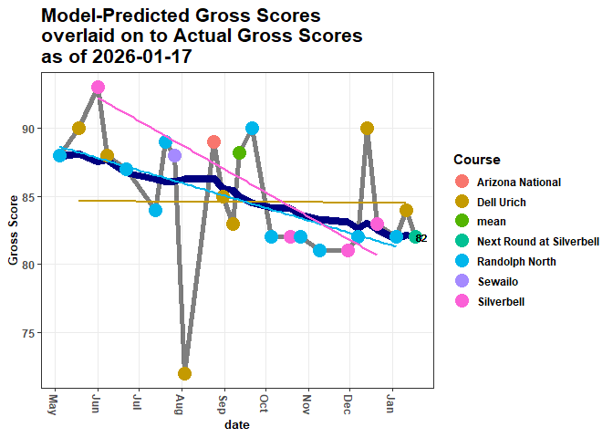

# Environment {.tabset .tabset-fade .tabset-pills}

## Attach Packages


``` r
library(golf)
library(tidyverse)
library(lme4)
library(mgcv)
library(brms)
library(DBI)
library(RSQLite)
library(emayili)
```

## Connect to the db


``` r
con <- RSQLite::dbConnect(drv = RSQLite::SQLite(), dbname = 'golf_data')
```

# Summarize Metrics {.tabset .tabset-pills .tabset-fade}

## Gather and Format

Gather and format from the database


``` r
scores <- DBI::dbGetQuery(conn = con, statement = paste0(
  "SELECT DISTINCT sub.* FROM
  (SELECT DISTINCT r.*, c.par, c.course_rating FROM rounds r
  LEFT JOIN courses c
  ON c.tees = r.tees
  AND c.course_name = r.course_name
  AND c.hole = r.hole
  AND c.hole_handicap = r.hole_handicap) AS sub
  INNER JOIN players p
  ON sub.GHIN = p.GHIN
  AND sub.handicap_index = p.handicap_index
  AND sub.date = p.date;"
)) |> 
  dplyr::mutate(date = lubridate::as_date(date),
                hole = stringr::str_extract(hole, pattern = '[0-9]{1,}') |> 
                  as.numeric()) |> 
  dplyr::relocate(par, .after = hole) |> 
  dplyr::relocate(course_rating, .after = tees) |>
  dplyr::group_by(date) |> 
  dplyr::arrange(desc(date), hole) |> 
  dplyr::ungroup()
```

## Compute Advanced Metrics

Compute more nuanced metrics


``` r
head(scores_sum)
```

```
## # A tibble: 6 × 25
## # Groups:   date, date_course, course_rating [6]
##   date       date_course        course_rating `Handicap Index`  FIRs `Iron FIRs`
##   <date>     <chr>                      <dbl>            <dbl> <dbl>       <dbl>
## 1 2025-05-04 "2025-05-04\nRand…          69.8             11.3    NA          NA
## 2 2025-05-18 "2025-05-18\nDell…          67.8             11.3    NA          NA
## 3 2025-06-01 "2025-06-01\nSilv…          68.9             11.8    NA          NA
## 4 2025-06-08 "2025-06-08\nDell…          67.8             12.1    NA          NA
## 5 2025-06-22 "2025-06-22\nRand…          69.8             12.9    NA          NA
## 6 2025-07-13 "2025-07-13\nRand…          69.8             13.3    10           2
## # ℹ 19 more variables: `Iron FIR%` <dbl>, `Driver FIRs` <dbl>,
## #   `Driver FIR%` <dbl>, `FIR%` <dbl>, GIRs <dbl>, `Par 3 GIRs` <dbl>,
## #   `GIR%` <dbl>, putts <dbl>, `Avg GIR putts` <dbl>, chips <dbl>,
## #   `chips+putts` <dbl>, `UpDown%` <dbl>, pars <int>, birdies <int>,
## #   bogies <int>, `doubles+` <int>, penalties <dbl>, `Gross Score` <dbl>,
## #   `Net Score` <dbl>
```

## Separate Metrics

Separate the metrics:

+ `scoring` (round scores & index)


``` r
scoring_metrics <- scores_sum |> 
  dplyr::select(`Handicap Index`, `Gross Score`, `Net Score`)
head(scoring_metrics)
```

```
## # A tibble: 6 × 6
## # Groups:   date, date_course, course_rating [6]
##   date       date_course            course_rating `Handicap Index` `Gross Score`
##   <date>     <chr>                          <dbl>            <dbl>         <dbl>
## 1 2025-05-04 "2025-05-04\nRandolph…          69.8             11.3            88
## 2 2025-05-18 "2025-05-18\nDell Uri…          67.8             11.3            90
## 3 2025-06-01 "2025-06-01\nSilverbe…          68.9             11.8            93
## 4 2025-06-08 "2025-06-08\nDell Uri…          67.8             12.1            88
## 5 2025-06-22 "2025-06-22\nRandolph…          69.8             12.9            87
## 6 2025-07-13 "2025-07-13\nRandolph…          69.8             13.3            84
## # ℹ 1 more variable: `Net Score` <dbl>
```

+ `strokes` (above/below par)


``` r
stroke_metrics <- scores_sum |> 
  dplyr::select(`doubles+`, bogies, pars, birdies)
head(stroke_metrics)
```

```
## # A tibble: 6 × 7
## # Groups:   date, date_course, course_rating [6]
##   date       date_course           course_rating `doubles+` bogies  pars birdies
##   <date>     <chr>                         <dbl>      <int>  <int> <int>   <int>
## 1 2025-05-04 "2025-05-04\nRandolp…          69.8          3      9     6       0
## 2 2025-05-18 "2025-05-18\nDell Ur…          67.8          7      6     5       0
## 3 2025-06-01 "2025-06-01\nSilverb…          68.9          7      8     3       0
## 4 2025-06-08 "2025-06-08\nDell Ur…          67.8          5      7     5       1
## 5 2025-06-22 "2025-06-22\nRandolp…          69.8          3      9     6       0
## 6 2025-07-13 "2025-07-13\nRandolp…          69.8          1     12     3       2
```

+ `around the green` (chips, putts, etc.)


``` r
atg_metrics <- scores_sum |> 
  dplyr::select(chips, `chips+putts`, `UpDown%`, putts, `Avg GIR putts`)
head(atg_metrics)
```

```
## # A tibble: 6 × 8
## # Groups:   date, date_course, course_rating [6]
##   date       date_course       course_rating chips `chips+putts` `UpDown%` putts
##   <date>     <chr>                     <dbl> <dbl>         <dbl>     <dbl> <dbl>
## 1 2025-05-04 "2025-05-04\nRan…          69.8    NA            NA        NA    NA
## 2 2025-05-18 "2025-05-18\nDel…          67.8    NA            NA        NA    NA
## 3 2025-06-01 "2025-06-01\nSil…          68.9    NA            NA        NA    NA
## 4 2025-06-08 "2025-06-08\nDel…          67.8    NA            NA        NA    NA
## 5 2025-06-22 "2025-06-22\nRan…          69.8    NA            NA        NA    NA
## 6 2025-07-13 "2025-07-13\nRan…          69.8    NA            NA        NA    28
## # ℹ 1 more variable: `Avg GIR putts` <dbl>
```

+ `ball striking` (approach and tee accuracy)


``` r
ball_striking_metrics <- scores_sum |> 
  dplyr::select(GIRs, `GIR%`, `Par 3 GIRs`,
                FIRs, `FIR%`, `Iron FIRs`, `Iron FIR%`,
                `Driver FIRs`, `Driver FIR%`)
head(ball_striking_metrics)
```

```
## # A tibble: 6 × 12
## # Groups:   date, date_course, course_rating [6]
##   date       date_course    course_rating  GIRs `GIR%` `Par 3 GIRs`  FIRs `FIR%`
##   <date>     <chr>                  <dbl> <dbl>  <dbl>        <dbl> <dbl>  <dbl>
## 1 2025-05-04 "2025-05-04\n…          69.8    NA   NA             NA    NA   NA  
## 2 2025-05-18 "2025-05-18\n…          67.8    NA   NA             NA    NA   NA  
## 3 2025-06-01 "2025-06-01\n…          68.9    NA   NA             NA    NA   NA  
## 4 2025-06-08 "2025-06-08\n…          67.8    NA   NA             NA    NA   NA  
## 5 2025-06-22 "2025-06-22\n…          69.8    NA   NA             NA    NA   NA  
## 6 2025-07-13 "2025-07-13\n…          69.8     3   16.7            0    10   71.4
## # ℹ 4 more variables: `Iron FIRs` <dbl>, `Iron FIR%` <dbl>,
## #   `Driver FIRs` <dbl>, `Driver FIR%` <dbl>
```

# Plot Metrics {.tabset .tabset-pills .tabset-fade}

Fit a lmer model to the data to capture repeated measurements of `Gross Score` 
predicted by `Handicap Index` and `course_rating`

+ The USGA calculates this index based on an individual's average of the 8 best `Gross Score`s over their 20 most recently-posted rounds
+ Every course has a rating; the `Handicap Index` calculation factors in these ratings


``` r
# Fit a model to the data

gross_lmer <- lme4::lmer(data = scores_sum |> 
              dplyr::ungroup() |> 
              dplyr::mutate(course_rating = dplyr::case_when(grepl(date_course, pattern = 'Sewailo') ~ 68.9,
                                                             TRUE ~ course_rating),
                            course_rating = mean(course_rating) - course_rating,
                            course = gsub(date_course, pattern = '[0-9]|\\-|\\\n|\\.', replacement = ''),
                            `Handicap Index` = mean(`Handicap Index`),
                            days = as.numeric(date - min(date), units = 'days')) |> 
                dplyr::relocate(days, .after = date),
            formula = `Gross Score` ~ `Handicap Index` + course_rating + days + (1 + `Handicap Index` | course*course_rating)
           )

summary(gross_lmer)
```

```
## Linear mixed model fit by REML ['lmerMod']
## Formula: `Gross Score` ~ `Handicap Index` + course_rating + days + (1 +  
##     `Handicap Index` | course * course_rating)
##    Data: 
## dplyr::relocate(dplyr::mutate(dplyr::ungroup(scores_sum), course_rating = dplyr::case_when(grepl(date_course,  
##     pattern = "Sewailo") ~ 68.9, TRUE ~ course_rating), course_rating = mean(course_rating) -  
##     course_rating, course = gsub(date_course, pattern = "[0-9]|\\-|\\\n|\\.",  
##     replacement = ""), `Handicap Index` = mean(`Handicap Index`),  
##     days = as.numeric(date - min(date), units = "days")), days,  
##     .after = date)
## 
## REML criterion at convergence: 133.4
## 
## Scaled residuals: 
##     Min      1Q  Median      3Q     Max 
## -3.3081 -0.4831  0.0462  0.4322  1.6115 
## 
## Random effects:
##  Groups               Name             Variance Std.Dev. Corr 
##  course:course_rating (Intercept)      70.86569 8.4182        
##                       `Handicap Index`  0.50083 0.7077   -1.00
##  course_rating        (Intercept)       3.46604 1.8617        
##                       `Handicap Index`  0.02449 0.1565   -1.00
##  course               (Intercept)       4.22346 2.0551        
##                       `Handicap Index`  0.02985 0.1728   -1.00
##  Residual                              18.61449 4.3145        
## Number of obs: 23, groups:  
## course:course_rating, 7; course_rating, 6; course, 5
## 
## Fixed effects:
##               Estimate Std. Error t value
## (Intercept)   88.17371    1.79241  49.193
## course_rating  0.28373    0.84637   0.335
## days          -0.02425    0.01185  -2.047
## 
## Correlation of Fixed Effects:
##             (Intr) crs_rt
## course_rtng -0.127       
## days        -0.865  0.147
## fit warnings:
## fixed-effect model matrix is rank deficient so dropping 1 column / coefficient
## optimizer (nloptwrap) convergence code: 0 (OK)
## boundary (singular) fit: see help('isSingular')
```

Predict the next round's `Gross Score` according to the model


``` r
## show the model-predicted gross score for the upcoming round, rounded to the nearest stroke
stats::predict(object = gross_lmer, newdata = new_df, allow.new.levels = T) |>
  as.numeric() %>%
  round(., 0)
```

```
## [1] 82
```

<!-- -->


``` r
DBI::dbDisconnect(conn = con)
```
