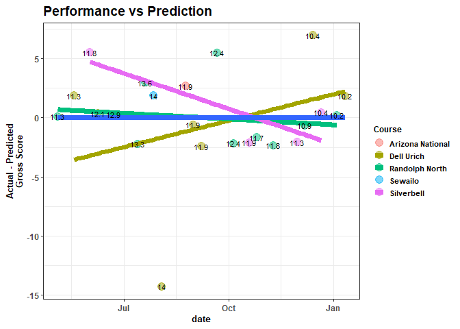

# Environment {.tabset .tabset-fade .tabset-pills}

## Attach Packages


``` r
library(golf)
library(tidyverse)
library(lme4)
library(mgcv)
library(brms)
library(DBI)
library(RSQLite)
library(emayili)
```

## Connect to the db


``` r
con <- RSQLite::dbConnect(drv = RSQLite::SQLite(), dbname = 'golf_data')
```

# Summarize Metrics {.tabset .tabset-pills .tabset-fade}

## Gather and Format

Gather and format from the database


``` r
scores <- DBI::dbGetQuery(conn = con, statement = paste0(
  "SELECT DISTINCT sub.* FROM
  (SELECT DISTINCT r.*, c.par, c.course_rating FROM rounds r
  LEFT JOIN courses c
  ON c.tees = r.tees
  AND c.course_name = r.course_name
  AND c.hole = r.hole
  AND c.hole_handicap = r.hole_handicap) AS sub
  INNER JOIN players p
  ON sub.GHIN = p.GHIN
  AND sub.handicap_index = p.handicap_index
  AND sub.date = p.date;"
)) |> 
  dplyr::mutate(date = lubridate::as_date(date),
                hole = stringr::str_extract(hole, pattern = '[0-9]{1,}') |> 
                  as.numeric()) |> 
  dplyr::relocate(par, .after = hole) |> 
  dplyr::relocate(course_rating, .after = tees) |>
  dplyr::group_by(date) |> 
  dplyr::arrange(desc(date), hole) |> 
  dplyr::ungroup()
```

## Compute Advanced Metrics

Compute more nuanced metrics


``` r
head(scores_sum)
```

```
## # A tibble: 6 × 25
## # Groups:   date, date_course, course_rating [6]
##   date       date_course        course_rating `Handicap Index`  FIRs `Iron FIRs`
##   <date>     <chr>                      <dbl>            <dbl> <dbl>       <dbl>
## 1 2025-05-04 "2025-05-04\nRand…          69.8             11.3    NA          NA
## 2 2025-05-18 "2025-05-18\nDell…          67.8             11.3    NA          NA
## 3 2025-06-01 "2025-06-01\nSilv…          68.9             11.8    NA          NA
## 4 2025-06-08 "2025-06-08\nDell…          67.8             12.1    NA          NA
## 5 2025-06-22 "2025-06-22\nRand…          69.8             12.9    NA          NA
## 6 2025-07-13 "2025-07-13\nRand…          69.8             13.3    10           2
## # ℹ 19 more variables: `Iron FIR%` <dbl>, `Driver FIRs` <dbl>,
## #   `Driver FIR%` <dbl>, `FIR%` <dbl>, GIRs <dbl>, `Par 3 GIRs` <dbl>,
## #   `GIR%` <dbl>, putts <dbl>, `Avg GIR putts` <dbl>, chips <dbl>,
## #   `chips+putts` <dbl>, `UpDown%` <dbl>, pars <int>, birdies <int>,
## #   bogies <int>, `doubles+` <int>, penalties <dbl>, `Gross Score` <dbl>,
## #   `Net Score` <dbl>
```

## Separate Metrics {.tabset .tabset-pills .tabset-fade}

Separate the metrics:

### Scoring Metrics

Round scores and `Handicap Index`


``` r
scoring_metrics <- scores_sum |> 
  dplyr::select(`Handicap Index`, `Gross Score`, `Net Score`)
head(scoring_metrics)
```

```
## # A tibble: 6 × 6
## # Groups:   date, date_course, course_rating [6]
##   date       date_course            course_rating `Handicap Index` `Gross Score`
##   <date>     <chr>                          <dbl>            <dbl>         <dbl>
## 1 2025-05-04 "2025-05-04\nRandolph…          69.8             11.3            88
## 2 2025-05-18 "2025-05-18\nDell Uri…          67.8             11.3            90
## 3 2025-06-01 "2025-06-01\nSilverbe…          68.9             11.8            93
## 4 2025-06-08 "2025-06-08\nDell Uri…          67.8             12.1            88
## 5 2025-06-22 "2025-06-22\nRandolph…          69.8             12.9            87
## 6 2025-07-13 "2025-07-13\nRandolph…          69.8             13.3            84
## # ℹ 1 more variable: `Net Score` <dbl>
```

### Stroke Metrics

Above/below par


``` r
stroke_metrics <- scores_sum |> 
  dplyr::select(`doubles+`, bogies, pars, birdies)
head(stroke_metrics)
```

```
## # A tibble: 6 × 7
## # Groups:   date, date_course, course_rating [6]
##   date       date_course           course_rating `doubles+` bogies  pars birdies
##   <date>     <chr>                         <dbl>      <int>  <int> <int>   <int>
## 1 2025-05-04 "2025-05-04\nRandolp…          69.8          3      9     6       0
## 2 2025-05-18 "2025-05-18\nDell Ur…          67.8          7      6     5       0
## 3 2025-06-01 "2025-06-01\nSilverb…          68.9          7      8     3       0
## 4 2025-06-08 "2025-06-08\nDell Ur…          67.8          5      7     5       1
## 5 2025-06-22 "2025-06-22\nRandolp…          69.8          3      9     6       0
## 6 2025-07-13 "2025-07-13\nRandolp…          69.8          1     12     3       2
```

### Around-the-Green Metrics

Chips, putts, etc.


``` r
atg_metrics <- scores_sum |> 
  dplyr::select(chips, `chips+putts`, `UpDown%`, putts, `Avg GIR putts`)
head(atg_metrics)
```

```
## # A tibble: 6 × 8
## # Groups:   date, date_course, course_rating [6]
##   date       date_course       course_rating chips `chips+putts` `UpDown%` putts
##   <date>     <chr>                     <dbl> <dbl>         <dbl>     <dbl> <dbl>
## 1 2025-05-04 "2025-05-04\nRan…          69.8    NA            NA        NA    NA
## 2 2025-05-18 "2025-05-18\nDel…          67.8    NA            NA        NA    NA
## 3 2025-06-01 "2025-06-01\nSil…          68.9    NA            NA        NA    NA
## 4 2025-06-08 "2025-06-08\nDel…          67.8    NA            NA        NA    NA
## 5 2025-06-22 "2025-06-22\nRan…          69.8    NA            NA        NA    NA
## 6 2025-07-13 "2025-07-13\nRan…          69.8    NA            NA        NA    28
## # ℹ 1 more variable: `Avg GIR putts` <dbl>
```

### Ball Striking

Approach and tee accuracy


``` r
ball_striking_metrics <- scores_sum |> 
  dplyr::select(GIRs, `GIR%`, `Par 3 GIRs`,
                FIRs, `FIR%`, `Iron FIRs`, `Iron FIR%`,
                `Driver FIRs`, `Driver FIR%`)
head(ball_striking_metrics)
```

```
## # A tibble: 6 × 12
## # Groups:   date, date_course, course_rating [6]
##   date       date_course    course_rating  GIRs `GIR%` `Par 3 GIRs`  FIRs `FIR%`
##   <date>     <chr>                  <dbl> <dbl>  <dbl>        <dbl> <dbl>  <dbl>
## 1 2025-05-04 "2025-05-04\n…          69.8    NA   NA             NA    NA   NA  
## 2 2025-05-18 "2025-05-18\n…          67.8    NA   NA             NA    NA   NA  
## 3 2025-06-01 "2025-06-01\n…          68.9    NA   NA             NA    NA   NA  
## 4 2025-06-08 "2025-06-08\n…          67.8    NA   NA             NA    NA   NA  
## 5 2025-06-22 "2025-06-22\n…          69.8    NA   NA             NA    NA   NA  
## 6 2025-07-13 "2025-07-13\n…          69.8     3   16.7            0    10   71.4
## # ℹ 4 more variables: `Iron FIRs` <dbl>, `Iron FIR%` <dbl>,
## #   `Driver FIRs` <dbl>, `Driver FIR%` <dbl>
```

# LMER Model {.tabset .tabset-pills .tabset-fade}

## Fit LMER

Fit a lmer model to the data to capture repeated measurements of `Gross Score` 
predicted by `Handicap Index` and `course_rating`

+ The `USGA` calculates this index based on an individual's **average of the 8 best** `Gross Score`s over their **20 most recently-posted** rounds
+ Every course has a rating; the `Handicap Index` calculation factors in these ratings


``` r
# Fit a model to the data

gross_lmer <- lme4::lmer(
  
  data = scores_sum |> 
    dplyr::ungroup() |> 
    dplyr::mutate(
      
      course_rating = mean(course_rating) - course_rating, # center the course ratings at the mean course rating
      
      course = gsub(date_course,
                    pattern = '[0-9]|\\-|\\\n|\\.',
                    replacement = ''), # extract the course names
      
      `Handicap Index` = mean(`Handicap Index`), # convert the index to a mean index
      
      days = as.numeric(date - min(date) + 1,
                        units = 'days')
      ) |> # create a 'days' metric starting at the first day joining the club 
    
    dplyr::relocate(days, .after = date),
  
  formula = `Gross Score` ~ 
    `Handicap Index` + 
    course_rating +
    days + (1 + `Handicap Index` | course*course_rating)
           )
```

## LMER Model Summary


```
## Linear mixed model fit by REML ['lmerMod']
## Formula: `Gross Score` ~ `Handicap Index` + course_rating + days + (1 +  
##     `Handicap Index` | course * course_rating)
##    Data: 
## dplyr::relocate(dplyr::mutate(dplyr::ungroup(scores_sum), course_rating = mean(course_rating) -  
##     course_rating, course = gsub(date_course, pattern = "[0-9]|\\-|\\\n|\\.",  
##     replacement = ""), `Handicap Index` = mean(`Handicap Index`),  
##     days = as.numeric(date - min(date) + 1, units = "days")),  
##     days, .after = date)
## 
## REML criterion at convergence: 139.6
## 
## Scaled residuals: 
##     Min      1Q  Median      3Q     Max 
## -3.3074 -0.5051  0.0335  0.5069  1.4588 
## 
## Random effects:
##  Groups               Name             Variance Std.Dev. Corr 
##  course:course_rating (Intercept)      65.68068 8.1044        
##                       `Handicap Index`  0.46968 0.6853   -1.00
##  course_rating        (Intercept)       4.56229 2.1360        
##                       `Handicap Index`  0.03263 0.1806   -1.00
##  course               (Intercept)       7.47346 2.7338        
##                       `Handicap Index`  0.05345 0.2312   -1.00
##  Residual                              18.79518 4.3353        
## Number of obs: 24, groups:  
## course:course_rating, 7; course_rating, 6; course, 5
## 
## Fixed effects:
##               Estimate Std. Error t value
## (Intercept)   87.83097    1.78009  49.341
## course_rating  0.32452    0.84965   0.382
## days          -0.02003    0.01126  -1.779
## 
## Correlation of Fixed Effects:
##             (Intr) crs_rt
## course_rtng -0.122       
## days        -0.868  0.140
## fit warnings:
## fixed-effect model matrix is rank deficient so dropping 1 column / coefficient
## optimizer (nloptwrap) convergence code: 0 (OK)
## boundary (singular) fit: see help('isSingular')
```

## Predict Next Round

Predict the next round's `Gross Score` according to the model


``` r
## show the model-predicted gross score for the upcoming round, rounded to the nearest stroke
stats::predict(object = gross_lmer, newdata = new_df, allow.new.levels = T) |>
  as.numeric() %>%
  round(., 0)
```

```
## [1] 82
```

## Model Interpretation

The aggregate average `Gross Score` (intercept of `Fixed effects`) is **87.83** (yikes, that's bad). 

+ For every **0.32** additional strokes relative to the average `course_rating` (how difficult the course is), the `Gross Score` **increases by 1 stroke**.

This makes sense. There's a lot of variation in `Gross Score` between and within courses, as shown by the `Random effects` `Variance` (`Intercept`s). Otherwise, we would expect `course_rating` to have a stronger relationship to `Gross Score`: the coefficient, representing the slope of the aggregate effect on `Gross Score`, i.e. independent of `course` and `Handicap Index`, would be larger.

+ A small `t-value` of this `Fixed effect` suggests it is a relatively weak predictor of `Gross Score`. This makes sense when viewing the `Scores` plot and comparing the relatively flat line of `course_rating` with the downward trend of `Handicap Index` and `Gross Score`.

The **-0.02** `Fixed effect estimate` of `days` on `Gross Score` means that, for every additional day, `Gross Score` decreases by **0.02** strokes; the `Gross Score` is getting smaller over time.

+ This effect is clearer than `course_rating`, as the magnitude of the `t value` is larger (and greater than 1), and is evident on the time-series graph of the `Scoring` plot, where `Gross Score` is roughly getting smaller over time (along the x-axis), overall and independent of course.

# Plot Model {.tabset .tabset-pills .tabset-fade}

## Model Predictions

<!-- -->

The model is a random intercept, random slope model.

In this case, that means `Gross Score` varies in its deviation from the overall mean `Gross Score` over time: `Silverbell`, `Randolph North`, and `Dell Urich` have their own slopes at different intercepts/heights along the y-axis.

+ The `gray` line just connects each sequential round (`Gross Score`) over time
+ The `blue` line is the model's predictions of each `Gross Score`, accounting for `course`, `course_rating`, `Handicap Index`, and `days` (time)
+ `Silverbell`'s line represents the relationship between `Gross Score`, `course_rating`, `Handicap Index`, and `days` (date/time) at `Silverbell`
+ `Randolph`'s line represents the relationship between `Gross Score`, `course_rating`, `Handicap Index`, and `days` (date/time) at `Randolph North`
+ `Dell Urich`'s line represents the relationship between `Gross Score`, `course_rating`, `Handicap Index`, and `days` (date/time) at `Dell Urich`

## Actual Gross Score vs Predicted Gross Score

<!-- -->

This plot of residuals reveals the actual `Gross Score` relative to the `Predicted Gross Score` over time, color-coded by `course`, and annotated by `Handicap Index` at the time of the round.

+ the navy blue line represents the dividing line between over/under performing where:

  + any scores below the line represent rounds where I performed better than the model's prediction
  + any scores above the line represent rounds where I performed worse than the model's prediction
  
+ `Randolph North`, `Silverbell`, and `Dell Urich` each have lines representing the trend of actual `Gross Score`s compared to predicted `Gross Score`s at each respective course.

  + I more often score better/lower at `Randolph North` than the model predicts, though, on average, these are closest to the model's predictions.
  
    + This might reveal that these rounds are contributing more weight to the model if they are not simply more reflective of the overall trend.
    
    + This could also reveal that I score more consistently at this course than others.
    
    + This could also mean that, given the downward trend, the course is easier than ratings suggest.
    
  + At `Silverbell` and `Randolph North`, I have been outperforming the model and scoring better over time.
    
  + The variability at `Dell Urich` is substantial, with one large outlier overperformance (~ **-15**), and one moderate outlier underperformance (~ **+6**) re-shaping the slope in the opposite direction: I have been getting worse at `Dell Urich` over time.
  
    + Even with more subsequent sample, this could reveal that I struggle to shoot low `Gross Score`s at `Dell Urich`, despite its easier course rating, and any effect of time.
    
    + Other latent variables may contribute to this variability, such as course/weather/event conditions.

## Actual Net Score vs Predicted Gross Score

<!-- -->

This plot of residuals shifts the previous plot upward, inverts it about the x-axis, and rotates it slightly about the origin, revealing the actual `Net Score` relative to the `Predicted Gross Score` over time, color-coded by `course`, and annotated by `Handicap Index` at the time of the round.

`Net Score` is roughly `Gross Score` - `Handicap Index`.

+ the navy blue line represents the dividing line between over/under performing where:

  + any scores below the line represent rounds where I performed worse than the model's prediction
  + any scores above the line represent rounds where I performed better than the model's prediction
  
+ `Randolph North`, `Silverbell`, and `Dell Urich` each have lines representing the trend of actual `Net Score`s compared to `Predicted Gross Score`s at each respective course.

  + I more often score better/lower at `Randolph North` than the model predicts, particularly over time, given my handicap; however, on average, these are closest to the model's predictions than other courses.
  
    + This reveals that these rounds could be giving more weight to the model.
    
    + This could also reveal that I more consistently, if slightly, outscore the model at this course, even given my `Handicap Index`.
    
    + This could also mean that the course is easier than ratings suggest.
    
    + My instinct is that my `Handicap Index` was overestimated early on in this time series; it was high, and I frequently played `Randolph North` around then, and shot lower scores, directing the trend downward.
    
  + The variability at `Dell Urich` is substantial, with one large outlier overperformance (~ **-15**), and one moderate outlier underperformance (~ **+6**) re-shaping the slope in the opposite direction (positive as opposed to a negative slope, like `Silverbell` and `Randolph North`).
  
    + Even with more subsequent sample, this could reveal that I struggle to shoot low `Gross Score`s at `Dell Urich`, despite its easier course rating.
    
      + See the plot below for more insight.
    
    + Other latent variables may contribute to this variability, such as course/weather/event conditions.

## Actual Gross Score vs Course Rating

<!-- -->


This definitely shows that I struggle at `Dell Urich`-- independent of time, my `Gross Score`s at `Dell Urich` are roughly similar to other courses despite its easier rating-- this would be even more evident without the substantial `Gross Score` **72** outlier.

+ Interestingly, I have scored better at longer/more difficult tees at multiple courses.

+ Removing the effect of time/improved skill, and the wildly underrated `Arizona National` rating, this would otherwise capture the general trend and logic that **higher `course ratings` correlate to higher `Gross Score`s**

## Actual Gross Score vs Handicap Index

<!-- -->

This also supports the ideas that, independent of time and `Handicap Index`, I struggle at `Dell Urich` because of the high `Gross Score`s at low `Handicap Index`:

+ Removing the outlier at a **`Handicap Index` of 14**, the `Dell Urich` trend still doesn't reverse, though the overall trend does-- independent of time and one outlier/corrective round, I perform worse at a course with a lower `Handicap Index`

## Actual Gross Score vs Handicap Index, 72 removed

<!-- -->


## Actual Net Score vs Course Rating

<!-- -->

## Actual Net Score vs Course Rating without 72 and Combo Tees

<!-- -->


