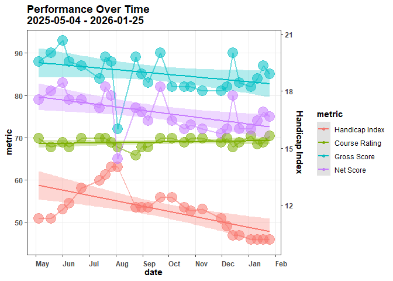
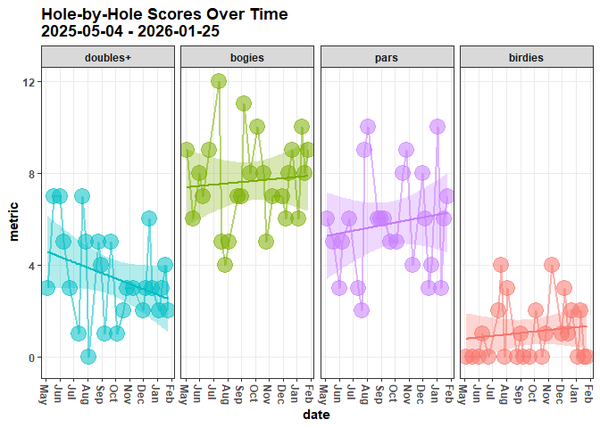
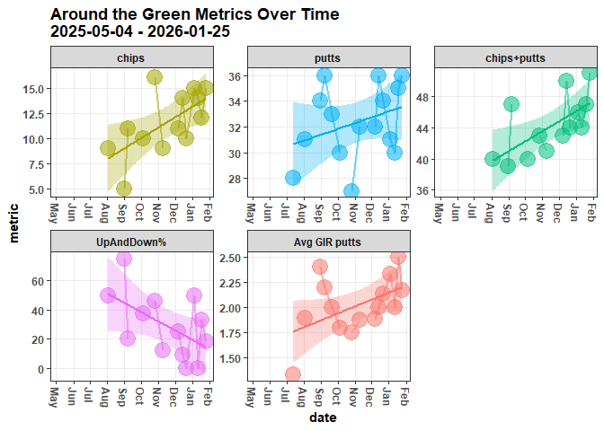
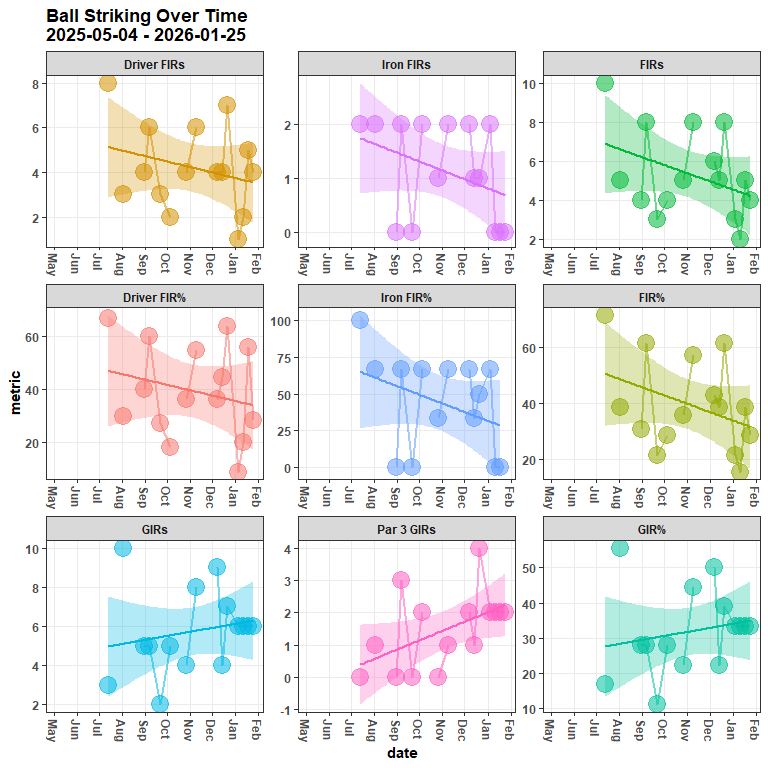
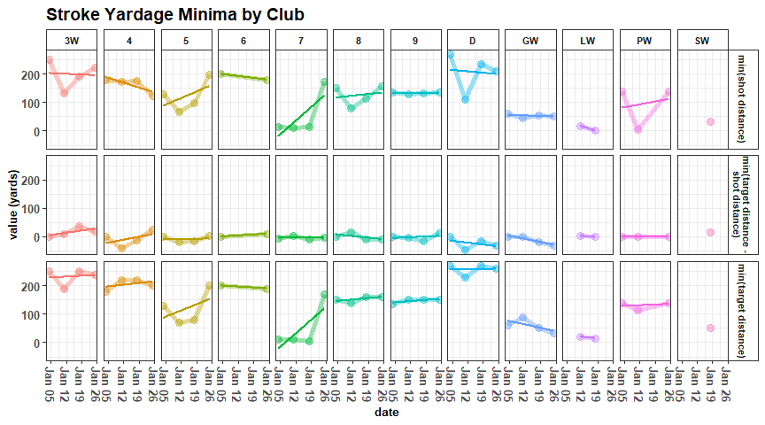
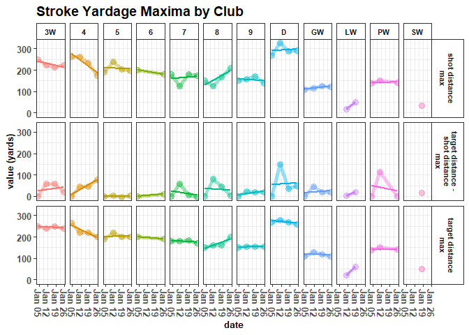
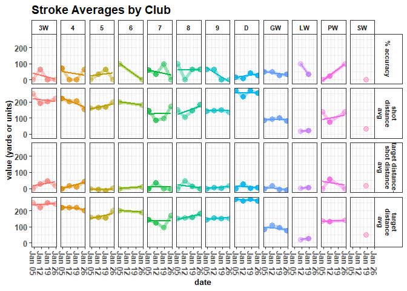
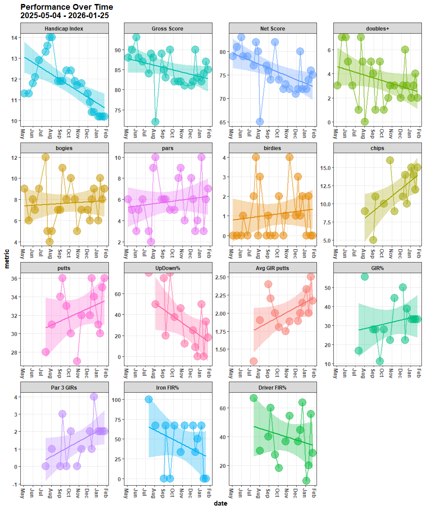

# Record New Scorecard {.tabset .tabset-pills .tabset-fade}

## Input the Scores Data


``` r
round_course <- ''
round_date <- ''
round_tees <- 'combo'

hole_scores <- c()

FIRs <- c()

GIRs <- c()

putts_rec <- c()

chips_rec <- c()

penalties_rec <- c()

tee_clubs <- c()

index <- 10.2
```


## Input Club Metrics


``` r
club_choice <- c(
  
)

dist_to_target <- c(
  
)

yds <- c(
  
)

lie_type <- c(
  
)

target_status <- c(
  
)

location <- c(
  
)

type_of_shot <- c(
  
)
```


# Summarize Metrics {.tabset .tabset-pills .tabset-fade}

## Gather and Format

Gather and format from the database


``` r
scores <- DBI::dbGetQuery(conn = con, statement = paste0(
  "SELECT DISTINCT sub.* FROM
  (SELECT DISTINCT r.*, c.par, c.course_rating FROM rounds r
  LEFT JOIN courses c
  ON c.tees = r.tees
  AND c.course_name = r.course_name
  AND c.hole = r.hole
  AND c.hole_handicap = r.hole_handicap) AS sub
  INNER JOIN players p
  ON sub.GHIN = p.GHIN
  AND sub.handicap_index = p.handicap_index
  AND sub.date = p.date;"
)) |> 
  dplyr::mutate(date = lubridate::as_date(date),
                hole = stringr::str_extract(hole, pattern = '[0-9]{1,}') |> 
                  as.numeric()) |> 
  dplyr::relocate(par, .after = hole) |> 
  dplyr::relocate(course_rating, .after = tees) |>
  dplyr::group_by(date) |> 
  dplyr::arrange(desc(date), hole) |> 
  dplyr::ungroup()
```


``` r
stroke_quality <- DBI::dbGetQuery(conn = con, statement = paste0(
  "SELECT DISTINCT * FROM club_metrics;"
)) |> 
  dplyr::mutate(date = lubridate::as_date(date),
                hole = stringr::str_extract(hole, pattern = '[0-9]{1,}') |> 
                  as.numeric()) |> 
  dplyr::group_by(date) |> 
  dplyr::arrange(desc(date), hole, stroke) |> 
  dplyr::ungroup()
```


## Compute Advanced Metrics

Compute more nuanced metrics


```
## # A tibble: 6 × 26
## # Groups:   date, date_course, course_rating [6]
##   date       date_course        course_rating `Handicap Index`  FIRs `Iron FIRs`
##   <date>     <chr>                      <dbl>            <dbl> <dbl>       <dbl>
## 1 2025-05-04 "2025-05-04\nRand…          69.8             11.3    NA          NA
## 2 2025-05-18 "2025-05-18\nDell…          67.8             11.3    NA          NA
## 3 2025-06-01 "2025-06-01\nSilv…          68.9             11.8    NA          NA
## 4 2025-06-08 "2025-06-08\nDell…          67.8             12.1    NA          NA
## 5 2025-06-22 "2025-06-22\nRand…          69.8             12.9    NA          NA
## 6 2025-07-13 "2025-07-13\nRand…          69.8             13.3    10           2
## # ℹ 20 more variables: `Iron FIR%` <dbl>, `Driver FIRs` <dbl>,
## #   `Driver FIR%` <dbl>, `FIR%` <dbl>, GIRs <dbl>, `Par 3 GIRs` <dbl>,
## #   `GIR%` <dbl>, putts <dbl>, `Avg GIR putts` <dbl>, chips <dbl>,
## #   `chips+putts` <dbl>, `UpDown%` <dbl>, pars <int>, birdies <int>,
## #   bogies <int>, `doubles+` <int>, penalties <dbl>, `Gross Score` <dbl>,
## #   `Net Score` <dbl>, `UpAndDown%` <dbl>
```

## View Metrics {.tabset .tabset-pills .tabset-fade}

Separate and view the metrics:

### Scoring Metrics

Scores and Handicap


```
## # A tibble: 6 × 6
## # Groups:   date, date_course, course_rating [6]
##   date       date_course            course_rating `Handicap Index` `Gross Score`
##   <date>     <chr>                          <dbl>            <dbl>         <dbl>
## 1 2025-05-04 "2025-05-04\nRandolph…          69.8             11.3            88
## 2 2025-05-18 "2025-05-18\nDell Uri…          67.8             11.3            90
## 3 2025-06-01 "2025-06-01\nSilverbe…          68.9             11.8            93
## 4 2025-06-08 "2025-06-08\nDell Uri…          67.8             12.1            88
## 5 2025-06-22 "2025-06-22\nRandolph…          69.8             12.9            87
## 6 2025-07-13 "2025-07-13\nRandolph…          69.8             13.3            84
## # ℹ 1 more variable: `Net Score` <dbl>
```

### Stroke Metrics

Pars, birdies, bogies, etc.


```
## # A tibble: 6 × 7
## # Groups:   date, date_course, course_rating [6]
##   date       date_course           course_rating `doubles+` bogies  pars birdies
##   <date>     <chr>                         <dbl>      <int>  <int> <int>   <int>
## 1 2025-05-04 "2025-05-04\nRandolp…          69.8          3      9     6       0
## 2 2025-05-18 "2025-05-18\nDell Ur…          67.8          7      6     5       0
## 3 2025-06-01 "2025-06-01\nSilverb…          68.9          7      8     3       0
## 4 2025-06-08 "2025-06-08\nDell Ur…          67.8          5      7     5       1
## 5 2025-06-22 "2025-06-22\nRandolp…          69.8          3      9     6       0
## 6 2025-07-13 "2025-07-13\nRandolp…          69.8          1     12     3       2
```

### Around-the-Green Metrics

Chips, putts, etc.


```
## # A tibble: 6 × 8
## # Groups:   date, date_course, course_rating [6]
##   date       date_course    course_rating chips `chips+putts` `UpAndDown%` putts
##   <date>     <chr>                  <dbl> <dbl>         <dbl>        <dbl> <dbl>
## 1 2025-05-04 "2025-05-04\n…          69.8    NA            NA           NA    NA
## 2 2025-05-18 "2025-05-18\n…          67.8    NA            NA           NA    NA
## 3 2025-06-01 "2025-06-01\n…          68.9    NA            NA           NA    NA
## 4 2025-06-08 "2025-06-08\n…          67.8    NA            NA           NA    NA
## 5 2025-06-22 "2025-06-22\n…          69.8    NA            NA           NA    NA
## 6 2025-07-13 "2025-07-13\n…          69.8    NA            NA           NA    28
## # ℹ 1 more variable: `Avg GIR putts` <dbl>
```

### Ball Striking Metrics

Approach and tee accuracy


```
## # A tibble: 6 × 12
## # Groups:   date, date_course, course_rating [6]
##   date       date_course    course_rating  GIRs `GIR%` `Par 3 GIRs`  FIRs `FIR%`
##   <date>     <chr>                  <dbl> <dbl>  <dbl>        <dbl> <dbl>  <dbl>
## 1 2025-05-04 "2025-05-04\n…          69.8    NA   NA             NA    NA   NA  
## 2 2025-05-18 "2025-05-18\n…          67.8    NA   NA             NA    NA   NA  
## 3 2025-06-01 "2025-06-01\n…          68.9    NA   NA             NA    NA   NA  
## 4 2025-06-08 "2025-06-08\n…          67.8    NA   NA             NA    NA   NA  
## 5 2025-06-22 "2025-06-22\n…          69.8    NA   NA             NA    NA   NA  
## 6 2025-07-13 "2025-07-13\n…          69.8     3   16.7            0    10   71.4
## # ℹ 4 more variables: `Iron FIRs` <dbl>, `Iron FIR%` <dbl>,
## #   `Driver FIRs` <dbl>, `Driver FIR%` <dbl>
```


### Club Metrics

Yardage and accuracy for each club


```
## # A tibble: 6 × 6
## # Groups:   date [1]
##   date       club      n rd_min_yds_to_target rd_min_yds_traveled rd_min_yd_diff
##   <date>     <chr> <int>                <dbl>               <dbl>          <dbl>
## 1 2026-01-04 3W        1                  250                 250              0
## 2 2026-01-04 4         7                  180                 180              0
## 3 2026-01-04 5         2                  130                 130              0
## 4 2026-01-04 6         1                  200                 200              0
## 5 2026-01-04 7         5                   10                  15             -5
## 6 2026-01-04 8         1                  150                 150              0
```


```
## # A tibble: 6 × 6
## # Groups:   date [1]
##   date       club      n rd_max_yds_to_target rd_max_yds_traveled rd_max_yd_diff
##   <date>     <chr> <int>                <dbl>               <dbl>          <dbl>
## 1 2026-01-04 3W        1                  250                 250              0
## 2 2026-01-04 4         7                  264                 264              0
## 3 2026-01-04 5         2                  190                 190              0
## 4 2026-01-04 6         1                  200                 200              0
## 5 2026-01-04 7         5                  180                 180              0
## 6 2026-01-04 8         1                  150                 150              0
```


```
## # A tibble: 6 × 10
## # Groups:   date [1]
##   date       club  `rd club strokes` miss_direction `rd club miss dir`
##   <date>     <chr>             <int> <chr>                       <int>
## 1 2026-01-04 3W                    1 right                           1
## 2 2026-01-04 4                     7 left                            1
## 3 2026-01-04 4                     7 on_target                       4
## 4 2026-01-04 4                     7 right                           1
## 5 2026-01-04 4                     7 short                           1
## 6 2026-01-04 5                     2 short                           2
## # ℹ 5 more variables: rd_avg_yds_to_target <dbl>, rd_avg_yds_traveled <dbl>,
## #   rd_avg_yd_diff <dbl>, rd_avg_accuracy <dbl>,
## #   `rd club % miss direction` <dbl>
```


# Plot Metrics {.tabset .tabset-pills .tabset-fade}

## Scoring Metrics

<!-- -->

## Stroke Metrics

<!-- -->

## Around the Green Metrics

<!-- -->

## Ball Striking Metrics

<!-- -->

## Stroke Quality Metrics {.tabset .tabset-pills .tabset-fade}

### Minima

<!-- -->

### Maxima

<!-- -->

### Average

<!-- -->

## Main Metrics

<!-- -->


