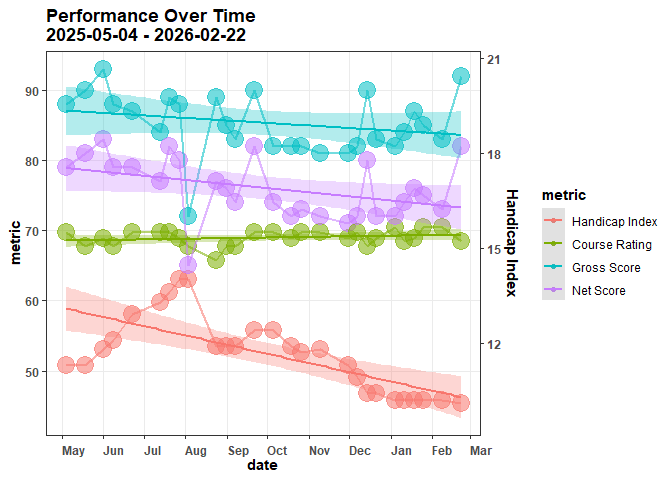
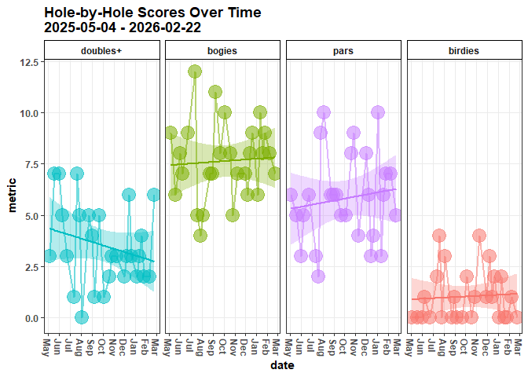
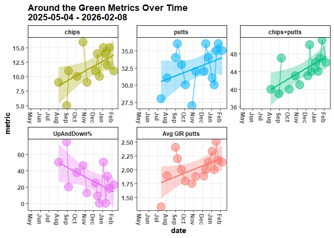
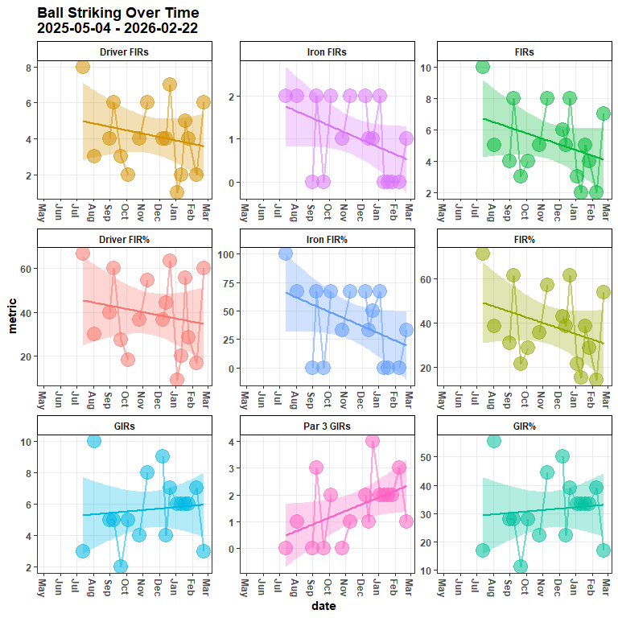
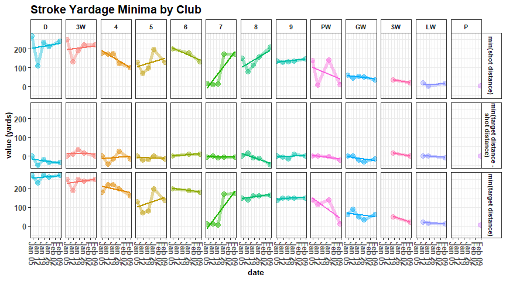
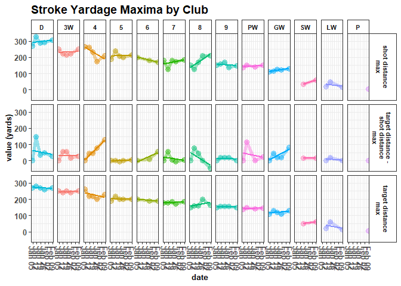
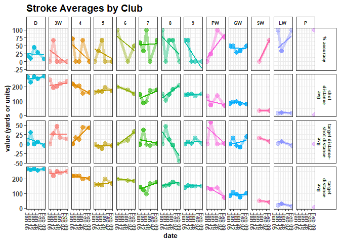
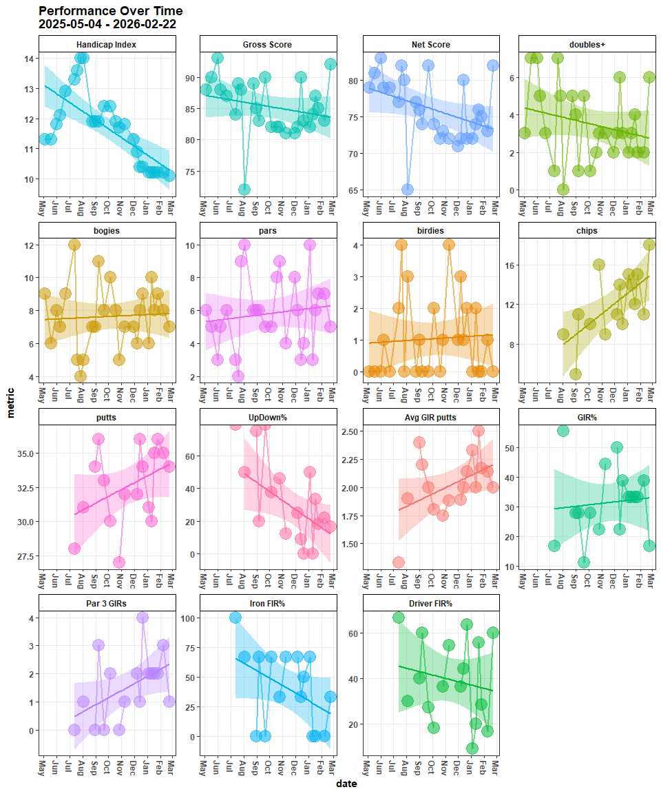

Scorecard Update

Erik Larsen

2026-02-09


## Record New Scorecard

### Input the Scores Data


``` r
round_course <- 'Randolph North'
round_date <- '2026-02-08'
round_tees <- 'combo'

hole_scores <- c(5, 5, 5, 5, 4, 4, 5, 4, 5,
                 4, 3, 6, 6, 5, 3, 4, 6, 4)

FIRs <- c(rep(0, 13), 1, 0, 1, 0, 0)

GIRs <- c(rep(0, 4), 1, 1, 0, 0, 1,
          0, 1, rep(0, 3), 1, 1, 0, 1) 

putts_rec <- c(2, 2, 1, 2, 2, 3, 2, 2, 2, 1, 2, 2, 2, 2, 2, 2, 2, 2)

chips_rec <- c(1, 1, 0, 1, 0, 0, 1, 0, 1, 1, 0, 1, 1, 1, 0, 0, 2, 0)

penalties_rec <- c(rep(0, 18))

tee_clubs <- c('4', 'D', 'D', 'D', 'D', 'PW', '3W', '7', 'D',
               'D', '7', 'D', 'D', 'D', '7', 'D', 'D', 'D')

index <- 10.2
```

### Input Club Metrics

(not shown for brevity)

## Summarize Metrics

### Gather and Format

Gather and format from the database


``` r
scores <- DBI::dbGetQuery(conn = con, statement = paste0(
  "SELECT DISTINCT sub.* FROM
  (SELECT DISTINCT r.*, c.par, c.course_rating FROM rounds r
  LEFT JOIN courses c
  ON c.tees = r.tees
  AND c.course_name = r.course_name
  AND c.hole = r.hole
  AND c.hole_handicap = r.hole_handicap) AS sub
  INNER JOIN players p
  ON sub.GHIN = p.GHIN
  AND sub.handicap_index = p.handicap_index
  AND sub.date = p.date;"
)) |> 
  dplyr::mutate(date = lubridate::as_date(date),
                hole = stringr::str_extract(hole, pattern = '[0-9]{1,}') |> 
                  as.numeric()) |> 
  dplyr::relocate(par, .after = hole) |> 
  dplyr::relocate(course_rating, .after = tees) |>
  dplyr::group_by(date) |> 
  dplyr::arrange(desc(date), hole) |> 
  dplyr::ungroup()
```


``` r
stroke_quality <- DBI::dbGetQuery(conn = con, statement = paste0(
  "SELECT DISTINCT * FROM club_metrics;"
)) |> 
  dplyr::mutate(date = lubridate::as_date(date),
                hole = stringr::str_extract(hole, pattern = '[0-9]{1,}') |> 
                  as.numeric()) |> 
  dplyr::group_by(date) |> 
  dplyr::arrange(desc(date), hole, stroke) |> 
  dplyr::ungroup()
```

## Plot Metrics

### Scoring Metrics

<!-- -->

### Stroke Metrics

<!-- -->

### Around the Green Metrics

<!-- -->

### Ball Striking Metrics

<!-- -->

### Stroke Quality Metrics

#### Minima

<!-- -->

#### Maxima

<!-- -->

#### Average

<!-- -->

### Main Metrics

<!-- -->


